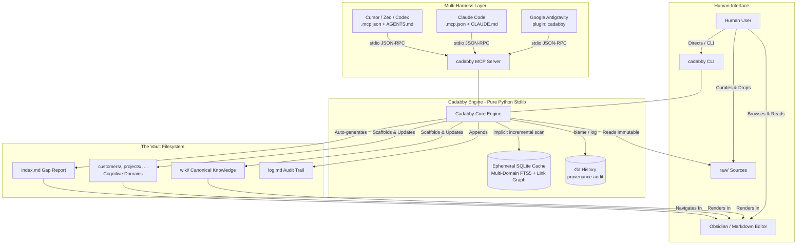
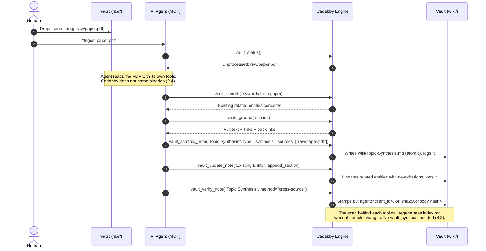

# Cadabby: Technical Specification

**Version:** 0.3.1  
**Status:** Approved Architecture (Multi-Domain Extended)  
**Author:** Pair programmed with Antigravity  
**Target Runtime:** CPython >= 3.11, standard library only

---

## 1. Executive Summary & System Vision

**Cadabby** is a zero-dependency, pure Python standard library engine (CLI + Model Context Protocol server) designed to power personal and shared **LLM Wiki vaults** optimized for seamless co-working between humans and autonomous AI agents.

It unifies four foundational paradigms:

1. **Andrej Karpathy's LLM Wiki Pattern**: A persistent, compounding knowledge base where the human curates raw, immutable sources and directs queries, while the AI agent acts as the primary "programmer" who compiles, updates, cross-references, and maintains the wiki markdown codebase.
2. **Open Knowledge Format (OKF v0.2)**: A rigorous epistemic trust hierarchy (`human-reviewed` > `machine-confirmed` > `stale-verified` > `unverified`) that resists hallucination compounding, enforces provenance, and keeps attribution auditable without suffocating agent autonomy.
3. **Self-Describing, Self-Governing Cognitive Domains**: Beyond the canonical `wiki/`, vaults can host arbitrary human-oriented and cognitive domains (e.g. `customers/`, `projects/`, `research/`), each governed by a local `{domain}/AGENTS.md` manifest defining note types, layout rules, source requirements, and prompt-injected agent directives.
4. **Multi-Harness Consumption**: First-class support for **Google Antigravity** (via native MCP tool provider, MCP resources, skills, and slash commands) and **Claude Code** (via `.mcp.json`, `CLAUDE.md`, and `.claude/commands/`), anchored by a single canonical constitution in `AGENTS.md` and localized domain directives.

### Key Tenets

* **Strict Zero Dependencies**: Requires only Python >= 3.11 and the standard library (`sqlite3`, `json`, `hashlib`, `re`, `argparse`, `pathlib`, `subprocess`). Eliminates virtualenv conflicts across heterogeneous agent subprocess environments.
* **Decoupled Engine**: Operates against any compliant Markdown vault directory; not bound to a single vault repository.
* **Disposable SQLite Cache**: Markdown files on disk are the single source of truth. The SQLite database (`.cadabby/cache.db`) is an ephemeral, disposable cache for incremental synchronization, multi-domain FTS5 BM25 search with epistemic boosting, and wikilink graph traversal. Deleting it is always safe.
* **Content-Bound Verification**: A verification record attests to *specific content*, not to a filename. Editing a note's body invalidates prior verifications automatically (§3.4). This is the mechanism that makes the trust hierarchy load-bearing rather than decorative.
* **Cognitive Domain Boundaries & Agent Autonomy**: Autonomous agents are provided both global vault principles (in `AGENTS.md`) and scoped behavioral constraints (in `{domain}/AGENTS.md`) injected during note grounding and surfaced via standard MCP Resources.
* **Auditability over Enforcement**: Cadabby does not claim to make forged human endorsements *impossible* — any agent with filesystem access can write arbitrary bytes. It makes them **unlikely by accident and detectable after the fact**: the engine refuses to stamp `human:*` over MCP, every write is atomic and Git-reversible, and `cadabby audit` cross-checks claimed human endorsements against Git authorship (§3.5).
* **Strict 7-Tool MCP Invariant**: Exactly 7 core tools are exposed to models, preventing cognitive tool degradation (§5.1). Domain policies are exposed via native MCP Resources (`resources/list`, `resources/read`), never by adding bloat tools.
* **Universal Portability**: A vault initialized with `cadabby init` works out of the box in Antigravity, Claude Code, Cursor, Zed, Codex, or any MCP-compatible environment. Portability is delivered by two files (`.mcp.json` and `AGENTS.md`); everything else in §7 is convenience on top.



---

## 2. Vault Architecture & Directory Conventions

A Cadabby vault adheres to a multi-domain architecture combining immutable evidence, canonical synthesis, and domain-scoped cognitive folders:

```text
my-vault/
├── .cadabby.json             # Vault configuration & root marker
├── .gitignore                # Ignores .cadabby/ and .obsidian/workspace*.json
├── .mcp.json                 # Standard MCP registration (auto-detected by harnesses)
├── AGENTS.md                 # Single canonical constitution & global agent directives
├── CLAUDE.md                 # Non-normative pointer delegating to AGENTS.md
├── GEMINI.md                 # Non-normative pointer delegating to AGENTS.md
├── STYLE.md                  # Voice, formatting, and prose standards
├── index.md                  # Auto-generated gap report: entry points, unfiled notes, raw queue
├── log.md                    # Append-only chronological activity ledger (active year)
│
├── log/                      # Rotated ledgers
│   └── 2025.md
│
├── .cadabby/                 # Disposable cache; gitignored (4)
│   └── cache.db
│
├── .agents/
│   ├── skills/               # CANONICAL persona runbooks (7.1)
│   │   ├── librarian/SKILL.md    # Ingestion, synthesis, cross-referencing
│   │   └── technician/SKILL.md   # Cache health, linting, pre-commit maintenance
│   └── plugins/cadabby/      # Antigravity plugin, copied in by init (7.2)
│       ├── plugin.json
│       ├── mcp_config.json
│       ├── skills/cadabby-wiki/SKILL.md
│       └── agents/           # Thin manifests -> .agents/skills/<persona>/
│           ├── librarian/agent.md
│           └── technician/agent.md
│
├── .claude/
│   └── commands/             # Thin slash-command shims (7.3)
│       ├── ingest.md
│       ├── vault-status.md
│       └── vault-lint.md
│
├── .obsidian/                # Optional: written only by init --obsidian (7.5)
│   ├── app.json              # Routes pasted attachments to raw/attachments/
│   └── templates.json        # Only with --obsidian-templates; names templates/ (7.5)
│
├── templates/                # Optional: pre-notes, excluded from discovery (7.5)
│   ├── Concept.md
│   └── MOC.md
│
├── raw/                      # LAYER 1: Immutable Ground Truth
│   ├── attachments/          # Obsidian paste/drop target, so media lands in Layer 1 (7.5)
│   ├── 2026-paper-kv.pdf
│   ├── web-clip-article.md
│   └── audio-transcript.txt
│
├── wiki/                     # LAYER 2: Canonical Flat Wiki & Maps of Content (LLM Maintained)
│   ├── Storage-MOC.md        # Maps of Content (MOC) hub notes
│   ├── AI-Systems-MOC.md
│   ├── Epistemic-Trust-Tiers.md
│   ├── Flash-Attention.md
│   ├── SQLite.md
│   ├── Anthropic.md
│   └── SQLite-vs-DuckDB.md
│
├── customers/                # COGNITIVE DOMAIN: Self-governing customer accounts
│   ├── AGENTS.md             # Domain manifest & localized AI agent directives
│   └── acme-corp/
│       ├── README.md         # Folder hub by domain convention — not engine-generated (§2.5)
│       └── Q3-Review.md
│
└── projects/                 # COGNITIVE DOMAIN: Self-governing engineering projects
    ├── AGENTS.md             # Domain manifest & localized AI agent directives
    └── apollo/
        └── README.md
```

### 2.1. Layer & Domain Responsibilities

| Layer / File | Primary Owner | Mutability | Description |
| :--- | :--- | :--- | :--- |
| **`raw/`** | Human | **Immutable** | Raw articles, web clips, PDFs, interview transcripts. Agents read but never modify. |
| **`wiki/`** | AI Agent | **Mutable** | Canonical flat knowledge synthesis: flat wiki notes (`wiki/*.md`) whose topology is governed by Maps of Content (`type: moc`) rather than folders (§2.5), with open note typing. Compiled and maintained by LLM. |
| **`{domain}/`** (e.g. `customers/`, `projects/`) | Human / Agent | **Mutable** | Self-governing cognitive domains hosting human-oriented or operational notes. Supports arbitrary nested subdirectories. |
| **`index.md`** | Engine | **Generated** | Vault-wide *gap report*: MOC entry points, wiki notes filed under no MOC, the raw source processing queue, and verification debt (§2.5). Not a catalog of every note. Never hand-edited. |
| **`log.md`** | Engine / Agent | **Append-Only** | Chronological record of ingests, queries, lint runs, and major syntheses. |
| **`AGENTS.md`** | Human / Agent | **Collaborative** | The global normative constitution for all AI agents working on this vault. |
| **`{domain}/AGENTS.md`** | Human / Domain Lead | **Normative** | Domain manifest (YAML schema constraints) and localized markdown agent directives injected during grounding (§2.2). |
| **`.agents/skills/`** | Human / Agent | **Collaborative** | Canonical persona runbooks. The only place persona behavior is defined (§7.1). |
| **`CLAUDE.md`**, **`GEMINI.md`** | Human | **Write-once** | Thin non-normative pointers to `AGENTS.md`. Seeded by `init` and thereafter user-owned (§7.4): no command rewrites them, because users customize them heavily. `init --force` is the sole exception and announces itself (§7.3). |

In `wiki/`, all notes reside directly in `wiki/*.md` with zero subdirectories. Knowledge topology and thematic clusters are governed by Maps of Content (`type: moc`) rather than physical folder hierarchies. Subdirectories within `wiki/` are strictly disallowed (`WIKI_NESTING_DISALLOWED`). In custom cognitive domains (`customers/`, `projects/`), nested subdirectories are fully supported (§2.2).

### 2.2. Self-Describing Cognitive Domains (`{domain}/AGENTS.md`)

Cadabby treats any non-reserved top-level directory in the vault as an independent **Cognitive Domain**. Reserved directories (`raw/`, `log/`, `.cadabby/`, `.obsidian/`, `.git/`, `.agents/`, `.claude/`) and standard tool ignore folders (`DEFAULT_IGNORED_DIRS`: `.venv/`, `node_modules/`, `target/`, `dist/`, etc.) are excluded automatically.

One further directory is excluded, and only when the user has declared it: the folder named by Obsidian's core Templates plugin, which holds pre-notes rather than notes (§7.5). The exclusion applies wherever that folder sits — a top-level one never becomes a domain, and a nested one such as `meta/templates/` is pruned from its parent domain's walk while the parent remains a domain in full.

A domain defines its governance rules and AI operational constraints through a local `{domain}/AGENTS.md` file:

```yaml
---
domain: customers
description: "Enterprise customer accounts, contacts, and contract histories"
allowed_types:
  - account
  - contact
  - meeting
require_sources: true
---
# Customer Domain Agent Instructions

All customer profiles must maintain enterprise confidentiality.
- Ground every account fact against primary signed contracts in `raw/`.
- Architectural design decisions must wikilink to canonical concepts in `[[wiki/...]]`.
```

#### Governance Schema Fields
* **`domain`** *(string, optional)*: Explicit domain identifier (defaults to directory name).
* **`description`** *(string, optional)*: High-level purpose of the cognitive domain.
* **`allowed_types`** *(list of strings, optional)*: If specified, `lint` gate 1 and `scaffold` strictly validate that notes in this domain use one of these types. If omitted (`None`), the domain is permissive and accepts any valid string type.
* **`require_sources`** *(boolean, default: `false`)*: If `true`, `lint` gate 4 treats missing or empty `sources:` as a validation error.

#### Fallback Behavior
* **Unconfigured Domains**: A top-level directory lacking `AGENTS.md` is discovered as a permissive cognitive domain (`allowed_types: None`, `require_sources: false`, empty directives). Custom domains support arbitrary nested subdirectories.
* **Canonical `wiki/` Domain**: If `wiki/AGENTS.md` is not present, `wiki/` automatically defaults to canonical governance: flat layout governed by Maps of Content (`type: moc`), open typing (`allowed_types: None`), `require_sources: false`.

#### Search Inclusion Is Structural, Not Configurable

**Every discovered domain is searchable, and there is no per-domain opt-out.** Exclusion from the index happens before a directory ever becomes a domain: reserved names (`raw/`, `log/`), dot-prefixed directories, and `DEFAULT_IGNORED_DIRS`. The scan walks only `raw/` and discovered domain paths, so root-level files (`index.md`, `log.md`, `AGENTS.md`, `STYLE.md`) are never indexed either. By the time a directory is a domain, it is markdown knowledge the user deliberately placed in the vault.

A per-domain `searchable: false` switch was specified in earlier drafts and deliberately removed, because a boolean is the wrong instrument twice over:

* **It makes search lie by omission.** An agent querying a term held only in a hidden domain gets zero results, concludes the knowledge does not exist, and scaffolds a duplicate note. Converting "I don't know" into "it isn't there" is strictly worse than returning a low-ranked match — the same failure mode as a stale ingestion queue (§4.3).
* **It is the wrong granularity.** Noise is a property of a note, not of a folder, and the vault already grades it per note: `deprecated`/`abandoned` at 0.4×, `draft` at 0.9× (§4.4). Should per-domain weighting ever be needed, the coherent form is a third multiplier beside trust and status (`ranking.domain`), which deprioritizes without hiding.

Callers that want a narrower result set pass `domain` to `vault_search` (§5.1), which puts the exclusion at the call site where the caller can see what they are leaving out. It is never a hidden property of the vault.

### 2.3. Generalized Content Identifiers (CIDs)

Cadabby uses canonical CIDs to uniquely reference notes across all cognitive domains:

* **Cognitive Domain Notes**: `rel_path` without file extension $\rightarrow$ `{domain}/{relative_stem}`.
  - `wiki/Epistemic-Trust-Tiers.md` $\rightarrow$ `wiki/Epistemic-Trust-Tiers`
  - `customers/acme-corp/README.md` $\rightarrow$ `customers/acme-corp/README`
  - `projects/apollo/rfc-001.md` $\rightarrow$ `projects/apollo/rfc-001`
* **Raw Sources**: Retain their filename and extension verbatim.
  - `raw/2026-paper-kv.pdf` $\rightarrow$ `raw/2026-paper-kv.pdf`
  - `raw/karpathy-llm-wiki-gist.md` $\rightarrow$ `raw/karpathy-llm-wiki-gist.md`

### 2.4. Raw Source Semantics

A file in `raw/` is **processed** if and only if at least one note in any cognitive domain lists it in `sources:`. This is derived, never stored — there is no ingestion state to drift out of sync, and `lint` gate 4 (§6.3) is its exact inverse.

**Cadabby does not extract text from binary sources.** A zero-dependency engine cannot read PDFs, audio, or images. Cadabby indexes the full text of every file whose extension appears in `raw_text_extensions` (§2.6); for every other file it indexes the filename and records existence, size, and provenance edges only. Extracting meaning from `raw/paper.pdf` is the **agent's** responsibility using its own file-reading tools — Cadabby tracks that the edge exists and that the file has not changed.

`raw_text_extensions` **replaces** the default list rather than extending it, which is what lets a vault exclude an extension it does not want indexed — a directory of large generated `.csv` files, for instance. The shipped `.cadabby.json` therefore lists all five defaults explicitly, so that editing the key shows what is being replaced.

**Raw sources are searchable, but not from the default corpus.** `vault_search` omits the raw layer unless `domain: "raw"` is passed. Two distinct reasons, and the second is the binding one:

* Curated notes are the answer to most questions; unprocessed sources would otherwise crowd them out.
* **BM25 scores a document against its corpus.** If raw sources shared the curated index, their term statistics would enter the scoring of every wiki query — thirty transcripts repeating a term drive its inverse document frequency to zero, and a note that scored 1.29 on that term scores 0.00 instead. Because the trust and status multipliers (§4.4) are applied *to* the BM25 score, a flattened score silently disables epistemic ranking: a `human-reviewed` note's 2.0× boost multiplies approximately nothing. A `WHERE` filter does not prevent this, because filtering happens after scoring. The two corpora are therefore held in two FTS5 tables (§4.2), which is the only arrangement under which each set of statistics describes the documents it actually ranks.

### 2.5. Navigation Topology: Maps of Content & `index.md`

Three mechanisms could organize a vault — physical folders, curated hub notes, and generated catalogs. Cadabby gives each exactly one job so that none of them duplicates another.

**`wiki/` topology is editorial, and lives in MOCs.** Because `wiki/` is flat by mandate (§2.1), thematic structure has to live in content rather than in paths. A Map of Content (`type: moc`) is a curated hub asserting a *judgment* — these notes belong together, in this order, for this reason. Nothing derives a MOC; that is the point of one. MOCs are ordinary notes, created and maintained with the same tools as any other note.

**`index.md` is a gap report, not a catalog.** An auto-generated table of every wiki note duplicates three things at once: what MOCs curate deliberately, what a file explorer already shows for a flat folder, and what `vault_search` ranks better — while churning the Git diff on every note added. `index.md` therefore enumerates only what nothing else surfaces:

1. **Entry points** — every `type: moc` note, linked. The human's starting page.
2. **Unfiled notes** — wiki notes reachable from no MOC by forward link at any depth. This is the one failure mode flat layout introduces: a note is born un-MOC'd and is thereafter findable only by search. `lint` gate 5 does *not* catch it — a note that links outward has outbound edges and so is not an orphan (§6.3).
3. **Raw sources** — each `raw/` file that no note cites yet. "Processed" is derived and never stored (§2.4), so this is the only place a human browsing the vault sees the ingestion queue. Processed sources are omitted rather than listed with a status, for the same reason the whole report omits filed notes: a source that has been ingested is not work.
4. **Verification debt** — notes whose verification entries have all gone stale (§3.4).

Each section is omitted when empty. Section 1 is navigation and persists in a healthy vault — losing your starting page precisely when the vault is in good order would be perverse. Sections 2 through 4 are the gap report proper, and every row in them is work someone still has to do; shrinking them to nothing is the objective, and a vault that gets there renders entry points and a line saying so.

Two scoping rules follow from that split. Entry points and unfiled notes are **`wiki/`-only**, because MOCs are a flat-namespace construct and domains carry their topology in folders. The raw queue and verification debt are **vault-wide**, because any note in any domain may cite `raw/` (§2.4) or carry verification entries (§3.4). Reachability for section 2 is transitive and may travel through any layer — a wiki note pulled in via a domain note is filed — but only `wiki/` notes are reported. `status: deprecated` notes are excluded from section 2: filing a retired note is not work, and counting it would give the report a floor it could never reach zero from.

**Cognitive domains generate nothing.** The engine writes no `{domain}/index.md`, and requires no MOCs there. Two reasons, in order of weight:

* Domains are self-governing (§2.2). Depositing an engine-owned, never-hand-edited file into `customers/` contradicts the promise that the domain's own `AGENTS.md` governs its layout.
* Domains have folders, so they already have topology. `customers/acme-corp/` *is* the grouping, and `customers/acme-corp/README.md` is conventionally that folder's hub — the role a MOC plays in a flat namespace. Mandating `type: moc` on top of that would additionally force every domain declaring `allowed_types` to whitelist `moc` or reject its own index note.

A domain that wants a maintained index declares it in its `{domain}/AGENTS.md` directives; the agent then maintains that note as ordinary domain content under the domain's own rules. The root `index.md` still covers the whole vault's raw-source queue, because a note in any domain may cite `raw/` (§2.4).

### 2.6. Vault Configuration (`.cadabby.json`)

The config file doubles as the vault root marker. Root discovery walks up from the working directory, exactly like `.git` — the full resolution order is in §2.7. All fields are optional; defaults shown.

```json
{
  "schema": 3,
  "vault_name": "my-vault",
  "raw_text_extensions": [".md", ".markdown", ".txt", ".rst", ".csv"],
  "integrity": "mtime_size",
  "ranking": {
    "trust": {
      "human-reviewed": 2.0,
      "machine-confirmed": 1.2,
      "stale-verified": 1.0,
      "unverified": 1.0
    },
    "status": {
      "evergreen": 1.0, "active": 1.0, "draft": 0.9,
      "completed": 0.85, "deprecated": 0.4, "abandoned": 0.4
    }
  },
  "identities": {
    "human:owner": ["owner@example.com"]
  },
  "log_rotate_bytes": 262144
}
```

`integrity` selects cache invalidation strategy: `"mtime_size"` (default, fast) or `"hash"` (stat plus SHA-256 of file bytes; immune to clock skew and same-second edits, costs a full read per file per scan).

`identities` maps OKF actor strings to Git author emails and is consumed only by `cadabby audit` (§3.5).

Unrecognized keys are carried through the merge untouched rather than rejected, so a config written for a newer or older Cadabby still loads. The cost is that a misspelled key is silently inert, and the engine must therefore never ship a key it does not read — see §7.5 for the one time it did.

### 2.7. Vault Resolution (normative)

Every command resolves exactly one vault root before doing anything else. The order is fixed:

1. **`--vault <path>`** — names the root *exactly*. Never walked up from.
2. **`$CADABBY_VAULT`** — names the root *exactly*, with the same no-walk-up rule. If it is set but does not name a vault, commands fail with that message rather than falling through to the working directory: a misconfigured variable that silently resolves somewhere else is how an agent writes into the wrong vault.
3. **The working directory**, walked upward to the first root marker.

A **root marker** is `.cadabby.json` or an `.obsidian/` directory. The second exists so that `cadabby init` can adopt an existing Obsidian vault in place rather than demanding a fresh directory; it means a plain Obsidian vault with no `.cadabby.json` resolves as a Cadabby root, which is intended but easy to be surprised by.

Only exact forms (1) and (2) are permitted to designate a root without a search, and this asymmetry is the point. Walking up is a convenience for a human standing in a subdirectory; it is a hazard for anything that names a vault deliberately, because the nearest marker above a wrong path is still a valid vault. §7.6 depends on this order: a bare `--global` install registers an **unbound** server precisely so that resolution happens per launch through (2) and (3) rather than being frozen into one absolute path at install time.

---

## 3. Epistemic Trust Tiers & OKF Frontmatter Specification

Every Markdown note across `wiki/` and all discovered cognitive domains must contain valid frontmatter conforming to Open Knowledge Format (OKF v0.2), expressed in the **Restricted YAML Subset** defined in §3.2. (Domain manifests `{domain}/AGENTS.md` use this same subset).

### 3.1. Frontmatter Schema

```yaml
---
type: moc | entity | concept | synthesis | comparison | guide | <domain-specific>
title: "Unique Human-Readable Title"
description: "One-line high-signal abstract or summary"
status: active | evergreen | draft | completed | deprecated | abandoned
tags:
  - knowledge-base
  - sqlite
sources:
  - raw/2026-paper-kv.pdf
  - raw/karpathy-llm-wiki-gist.md
verified:
  - by: human:owner
    at: '2026-10-03T12:00:00Z'
    method: manual-review
    of: 'sha256:9f2b7c1e4a8d05f3b6c29e7d1a4f80b35c6e9d2a7f41b8c035e6d9a2f74b1c80'
generated:
  by: agent:claude-opus-5
  at: '2026-10-03T11:45:00Z'
---
```

**Required**: `type`, `title`, `description`, `status`. **Optional**: `tags`, `sources`, `verified`, `generated`. Timestamps are RFC 3339 UTC with a `Z` suffix and must be single-quoted (an unquoted YAML timestamp is a typed scalar in full YAML, and the subset avoids implicit typing entirely).

* **Type Validation**: Cadabby recognizes six canonical note types (`moc`, `concept`, `entity`, `comparison`, `synthesis`, `guide`). In `wiki/`, open typing is supported by default (`allowed_types: None`), allowing dynamic note types. `moc` is distinguished only in that `index.md` lists Maps of Content as the vault's entry points and measures coverage against them (§2.5). In custom cognitive domains, `type` must match one of the entries in the domain's declared `allowed_types` (§2.2); if the domain defines no `allowed_types`, any non-empty string scalar is accepted.
* **Sources Requirement**: `sources` is optional by default, but is **required** whenever the note's enclosing cognitive domain specifies `require_sources: true` in `{domain}/AGENTS.md`.
* **Tag Grammar**: a tag is one or more segments joined by `/`; each segment is one or more runs of letters or digits joined by `-`. In short: lowercase kebab-case, with `/` reserved for hierarchy (`knowledge-base`, `trust/human-reviewed`). Segments match unicode letters and digits rather than ASCII, so non-English tags are conformant. **Whitespace is forbidden**, and this is a storage contract rather than a style preference: the cache stores a note's tags space-joined (§4.2), so a tag containing a space makes the `--tag` facet match notes that do not carry it. Lint therefore reports whitespace as a `TAG_MALFORMED` *error*, and a tag that is merely non-canonical (uppercase, underscores) as a `TAG_MALFORMED` *warning* — the canonicalizing writer (§3.2) repairs the latter on the next write, and the former it cannot.

**Deliberately omitted: `updated: {by, at}`.** The only epistemic question modification tracking needs to answer is "has this drifted since it was reviewed?", and `body_hash` vs. `of:` (§3.4) answers it from content rather than from a clock — immune to skew, out-of-order writes, and an agent forgetting to bump a field. Last-writer attribution is recorded losslessly by `log.md` and by Git, whereas a single overwritten slot would be lossy and self-reported. Note that `git clone` resets mtime to checkout time while preserving `git log`; conversely zip, Dropbox, Syncthing, and rsync preserve mtime but carry no history — so every realistic distribution path retains at least one of the two. Revisit only if a recency multiplier is added to ranking (§4.4), and even then prefer backfilling the timestamp from `git log` into the disposable cache over putting it in-band.

### 3.2. Restricted YAML Subset (normative)

A hand-rolled "robust YAML parser" is an unbounded project, and a lossy round-trip corrupts a human's hand-edited file. Cadabby therefore accepts a deliberately small, fully specified subset and **fails loudly** on anything outside it.

**Accepted grammar.** The frontmatter block is delimited by `---` on its own line at byte 0 and a closing `---`. Within it:

* **Block mappings** at indent 0: `key: value`.
* **Block mappings of scalars nested one level**: a key whose value is itself a mapping, its members indented 2 spaces — the shape `generated:` uses (§3.1). Members must be scalars; nesting stops here.
* **Block sequences** of scalars: `- value`, indented 2 spaces under their key.
* **Block sequences of flat mappings**: `- key: value` followed by sibling `key: value` lines at the dash's content indent. Nesting depth stops here.
* **Scalars**: bare (`active`), single-quoted, or double-quoted. Escapes recognized inside double quotes: `\\ \" \n \t`. Bare scalars are never implicitly typed — everything is a string except the literals `true`, `false`, and `null`.
* **Comments**: a `#` beginning a line, or preceded by whitespace outside a quoted scalar. Comments and blank lines are preserved on round-trip where the surrounding structure is unchanged.

**Explicitly rejected**: flow style (`[a, b]`, `{k: v}`), anchors and aliases (`&`, `*`), tags (`!!str`), multi-line scalars (`|`, `>`), multi-document markers, mappings nested more than two levels, and sequences of sequences.

**Failure behavior (read side).** A file whose frontmatter does not parse is **never written to**. It is recorded in the cache with `parse_error` set, excluded from search and graph results, and reported by `lint` as a `FRONTMATTER_UNPARSEABLE` error naming the offending line. Best-effort partial parsing is forbidden: a parser that guesses is a parser that silently destroys user data.

**Failure behavior (write side).** The same prohibition binds the writer, and binds it harder. Given a value the subset cannot express — a mapping nested two levels deep, a sequence inside a mapping — the writer **raises and emits nothing**; it must never coerce the value to text. The temptation is a language-level stringification, and the consequence is specific and severe: the structured value is destroyed, the emitted file is rejected by this very parser, and the note is therefore recorded with `parse_error` and **disappears from search** while the write reports success. That is the engine inflicting silent incompleteness on its own retrieval surface, which §1 ranks as the worst available outcome. The error names the offending key path (`provenance.import`), because an agent that cannot see which field it got wrong will retry the same call. Note that the write path is reachable from `vault_update_note`'s `patch_frontmatter`, which accepts an arbitrary JSON object — so this is an input-validation boundary, not a theoretical one.

**Canonicalizing writer.** Every Cadabby write emits the canonical form: keys in schema order (`type`, `title`, `description`, `status`, `tags`, `sources`, `verified`, `generated`, then unrecognized keys alphabetically, preserved verbatim), two-space sequence indent, single-quoted timestamps, bare scalars where unambiguous. The writer additionally lowercases and de-duplicates `tags`, preserving first-seen order, and **refuses the write** if any tag contains whitespace — lowercasing cannot repair that, and emitting it would corrupt the `--tag` facet (§3.1). Humans may author anything inside the subset; the first agent write normalizes the file. This bounds the round-trip problem to "read subset, write one canonical form," which is testable to exhaustion.

### 3.3. Body Hash (normative)

The **body** is everything after the closing `---` of the frontmatter block. Its hash is computed over the normalized body:

1. Decode UTF-8.
2. Normalize line endings to `\n`.
3. Strip trailing whitespace from each line.
4. Strip leading and trailing blank lines.
5. Encode UTF-8, `sha256`, lowercase hex, prefixed `sha256:`.

The hash deliberately **excludes frontmatter**, so that retagging, restatusing, or adding a source does not invalidate a human's review of the prose. It is recomputed on every cache scan and stored as `notes.body_hash`.

### 3.4. Trust Tier Derivation

A verification entry is **valid** when its `of:` field is present and equals the note's current `body_hash`. The tier is derived from valid entries only:

1. **`human-reviewed`**: at least one *valid* entry with `by: human:*`. This represents ground truth for AI agents.
2. **`machine-confirmed`**: no valid human entry, but at least one *valid* entry with `by: agent:*` or `by: process:*`.
3. **`stale-verified`**: `verified` is non-empty, but no entry is valid — every attestation refers to content that has since changed, or predates the `of:` requirement. The records are preserved; the trust is not.
4. **`unverified`**: `verified` is absent or empty. Default state for newly scaffolded pages.

Actor strings match `^(human|agent|process):[A-Za-z0-9._\-/]+$`. A version suffix after `/` (`agent:gemini-flash/1.5`) is permitted and carries no special meaning.

**Why this matters.** Without content binding, a human verifies a note, an agent rewrites half of it, and the note reads `human-reviewed` forever — reintroducing the exact hallucination compounding the trust hierarchy exists to prevent. Drift is surfaced, not hidden: `status` reports a **verification debt** count, and `lint` gate 6 lists every stale note.

### 3.5. Identity, Attribution & Provenance Audit

Cadabby's identity model is a **convention with an audit trail**, not a security boundary. Stating the limits precisely:

* **What the engine guarantees.** The MCP server refuses to write `by: human:*` under any circumstances, and stamps `by: agent:<client_id>` taken from the JSON-RPC `initialize` handshake's `clientInfo.name`. `cadabby verify --human` requires an interactive TTY (`sys.stdin.isatty()`) and stamps `by: human:<os-username>`. Every write is atomic and leaves the vault in a Git-revertible state.
* **What it does not guarantee.** Agents that speak MCP in practice also hold filesystem and shell access; such an agent can edit the markdown directly or invoke the CLI. `clientInfo` is self-reported and unauthenticated, so `agent:<client_id>` is a claim, not an identity. The mechanism prevents *accidental* forgery — the overwhelmingly common case — and nothing more.
* **What is actually verifiable.** Git already records authenticated-ish authorship. `cadabby audit` locates the line introducing each `human:*` verification entry, runs `git blame --porcelain` on it, and compares the commit author email against the `identities` map in `.cadabby.json`. A mismatch — most importantly a human endorsement introduced by a commit authored by an agent — is reported as `PROVENANCE_MISMATCH`. With `--require-signed`, unsigned commits touching `human:*` lines are also flagged (`git log --show-signature`). This turns an unenforceable claim into a detectable one at the cost of one `subprocess` call per note.

`audit` is a no-op with a clear notice when the vault is not a Git repository.

---

## 4. SQLite Ephemeral Cache & Search Engine

The SQLite cache lives at `.cadabby/cache.db` and is 100% disposable. If deleted, any command reconstructs it on the next scan.

### 4.1. Runtime Capability Check

FTS5 ships with most but not all CPython SQLite builds. On first connection Cadabby probes for it and, if absent, aborts with an actionable message naming the Python interpreter and its `sqlite3.sqlite_version` rather than failing mid-query. Connections open with `PRAGMA journal_mode=WAL` and `PRAGMA busy_timeout=5000`.

### 4.2. Database Schema

`files` and `notes` are deliberately **one table** — they were 1:1 on `rel_path` and nothing was gained by splitting them.

```sql
-- One row per tracked file. Covers wiki/ notes and raw/ sources alike.
CREATE TABLE IF NOT EXISTS notes (
    id           INTEGER PRIMARY KEY,          -- FTS5 external-content rowid
    cid          TEXT NOT NULL UNIQUE,         -- "wiki/Epistemic-Trust-Tiers"
    rel_path     TEXT NOT NULL UNIQUE,         -- "wiki/Epistemic-Trust-Tiers.md"
    stem         TEXT NOT NULL,                -- "Epistemic-Trust-Tiers"
    layer        TEXT NOT NULL,                -- cognitive domain ("wiki", "customers", ...) | "raw"

    -- Invalidation
    mtime        REAL NOT NULL,
    file_size    INTEGER NOT NULL,
    file_hash    TEXT,                         -- populated only when integrity="hash"
    indexed_at   TEXT NOT NULL,

    -- Parsed OKF metadata (NULL for raw/ files)
    title        TEXT,
    description  TEXT,
    type         TEXT,
    status       TEXT,
    trust_tier   TEXT,                         -- derived, see 3.4
    body_hash    TEXT,                         -- see 3.3
    frontmatter_json TEXT,                     -- verbatim parsed frontmatter
    parse_error  TEXT,                         -- non-NULL => excluded from search

    -- Space-joined tags, denormalized from frontmatter_json. Required, see below.
    tags         TEXT NOT NULL DEFAULT '',

    -- Full text, stored once. Empty for binary raw/ sources.
    body         TEXT NOT NULL DEFAULT ''
);
CREATE INDEX IF NOT EXISTS idx_notes_layer_type ON notes(layer, type);
CREATE INDEX IF NOT EXISTS idx_notes_trust ON notes(trust_tier);

-- Wikilink graph. target_cid is NULL for dead links, which is what lint reads.
CREATE TABLE IF NOT EXISTS links (
    id          INTEGER PRIMARY KEY,
    source_cid  TEXT NOT NULL,
    target_raw  TEXT NOT NULL,                 -- "Flash-Attention#Tiling" exactly as written
    target_cid  TEXT,                          -- resolved; NULL = broken link
    alias       TEXT,                          -- "[[Note|alias]]" -> "alias"
    anchor      TEXT,                          -- "[[Note#heading]]" -> "heading"
    occurrences INTEGER NOT NULL DEFAULT 1
);
CREATE UNIQUE INDEX IF NOT EXISTS idx_links_edge
    ON links(source_cid, target_raw);
CREATE INDEX IF NOT EXISTS idx_links_target ON links(target_cid);
CREATE INDEX IF NOT EXISTS idx_links_source ON links(source_cid);

-- Provenance edges: wiki note -> raw source. Drives "processed" derivation (2.4).
CREATE TABLE IF NOT EXISTS sources (
    source_cid  TEXT NOT NULL,                 -- the wiki note
    raw_path    TEXT NOT NULL,                 -- as written in frontmatter
    resolved    INTEGER NOT NULL,              -- 1 if the file exists in raw/
    PRIMARY KEY (source_cid, raw_path)
);
CREATE INDEX IF NOT EXISTS idx_sources_raw ON sources(raw_path);

-- Contentless-external FTS5: the index is built, the text is not duplicated.
-- Two tables over the same content table, one per corpus: curated notes in
-- notes_fts, raw sources in raw_fts. A row belongs to exactly one of them,
-- chosen by its layer. See below for why this is not one table with a filter.
CREATE VIRTUAL TABLE IF NOT EXISTS notes_fts USING fts5(
    title, description, body, tags,
    content = 'notes',
    content_rowid = 'id',
    tokenize = 'porter unicode61'
);

CREATE VIRTUAL TABLE IF NOT EXISTS raw_fts USING fts5(
    title, description, body, tags,
    content = 'notes',
    content_rowid = 'id',
    tokenize = 'porter unicode61'
);

CREATE TABLE IF NOT EXISTS cache_meta (
    key TEXT PRIMARY KEY,
    value TEXT NOT NULL
);
```

**The `tags` column is load-bearing, not a convenience.** External-content FTS5 keeps only the inverted index and reads column values back from the content table, so every column declared in `notes_fts` must also exist in `notes`. Drop `tags` from `notes` and the failure is immediate and total rather than subtle: loading a row fails, so `snippet()` raises `SQL logic error` on *every* search — the query at §4.4 calls it unconditionally — and `INSERT INTO notes_fts(notes_fts) VALUES('rebuild')` fails with `no such column: T.tags`. The column earns its place twice over: holding tags space-joined also lets the `--tag` filter run as a SQL predicate, `instr(' ' || n.tags || ' ', ' ' || :tag || ' ') > 0`, instead of re-parsing `frontmatter_json` for every candidate row. That predicate is exact only because the tag grammar forbids whitespace (§3.1); without that rule `--tag machine` would match a note tagged solely `machine learning`. `instr` is case-sensitive, so the probe is lowercased at the call site — safe precisely because stored tags are canonically lowercase.

Because the index lives outside the content table, it must be maintained explicitly alongside every `notes` mutation:

```sql
-- Before updating or deleting a row, retract the old index entry.
-- The values passed here MUST be the row's OLD column values, read back
-- from `notes` first. Passing the new values silently corrupts the index:
-- the old terms are never retracted and stale matches persist forever.
INSERT INTO notes_fts(notes_fts, rowid, title, description, body, tags)
    VALUES('delete', :id, :old_title, :old_description, :old_body, :old_tags);
```

This is the single sharpest edge in the cache layer, so it is confined to one `cache.upsert_note()` / `cache.delete_note()` pair; **no other code path may write `notes` directly**. `test_cache.py` asserts the retraction by rewriting a note's body and confirming the old term no longer matches, then running `INSERT INTO notes_fts(notes_fts) VALUES('integrity-check')` on both tables.

With two indexes the retraction has a second way to go wrong: it must target **the table the row was written to**. Retracting against the wrong table leaves the real entry standing and corrupts the other, and like a retraction with the wrong values it fails silently. A single `_fts_table(layer)` mapping therefore serves every read and write, so no call site re-derives it. Note that a file never changes layer in place — the layer is a pure function of `rel_path`, so moving a file between `raw/` and a cognitive domain reaches the cache as a delete followed by an insert, not an update.

The integrity check runs against **both** tables. A mismatched retraction damages one index while leaving the other clean, so checking only the curated one would report health while raw search returned wrong rows.

`cache_meta` holds `schema_version`. **There are no migrations**: a version mismatch deletes `cache.db` and rebuilds. This is a disposable cache, and that freedom is worth more than incremental upgrade paths.

### 4.3. Synchronization

Sync is **implicit**. Every read command (`search`, `ground`, `status`, `graph`, `lint`) performs an incremental scan first, and so does every write; `cadabby sync` merely exposes the scan for debugging and forces a full pass. An agent cannot forget to sync, because it cannot sync.

The scan walks `raw/` and all discovered cognitive domains (`wiki/`, `customers/`, `projects/`, etc.), skipping `DEFAULT_IGNORED_DIRS` and domain manifest files (`{domain}/AGENTS.md`). It `stat`s every file, and:

1. **Inserts** paths absent from `notes`.
2. **Reparses** paths whose `(mtime, file_size)` pair differs — or whose SHA-256 differs, under `integrity: "hash"`.
3. **Deletes** rows whose `rel_path` no longer exists on disk, including their `links`, `sources`, and FTS rows — retracted from whichever of the two indexes the row's layer selects, never from both and never from the wrong one (§4.2). *(Deletion reconciliation is not optional; without it, a renamed note haunts search results indefinitely.)*
4. Re-resolves `links.target_cid` for every edge whose target set changed.

`(mtime, file_size)` misses the pathological case of a same-second, same-length edit; `integrity: "hash"` exists for vaults where that matters. A full stat sweep of a few thousand notes costs single-digit milliseconds, so there is no staleness heuristic to get wrong.

**Index regeneration rides the scan.** Any scan reporting a non-zero change count regenerates `index.md` before returning, whichever entry point triggered it — CLI command, MCP tool, or `sync`. A scan that found no changes skips regeneration entirely; `cadabby sync` regenerates unconditionally.

This means an MCP *read* tool can write one file, which is deliberate. `index.md` is a gap report (§2.5), and a stale queue listing an already-ingested source as unprocessed will send an agent to redo work that is already done — a failure strictly worse than having no queue at all. Binding regeneration to the scan rather than to the write path also covers the common case the write path misses: a human dropping a PDF into `raw/` changes the vault without any Cadabby write. The cost is bounded by §8's byte-comparison guard, so regeneration that produces identical bytes writes nothing and leaves no Git diff.

### 4.4. Epistemic BM25 Rank Boosting & Domain Filtering

SQLite's `bm25()` returns **negative** values, more negative meaning a better match, so that `ORDER BY rank` ascending yields best-first. Multiplying a negative score is sign-sensitive and inverts silently if anyone later sorts the other way, so the sign is normalized once, at the query:

```sql
-- {fts} is notes_fts, or raw_fts when :domain is exactly 'raw' (§4.2).
-- It is selected by the engine from the layer, never interpolated from
-- caller input, so the table name cannot carry an injection.
SELECT n.cid,
       (-bm25({fts}, 4.0, 2.0, 1.0, 1.5))
         * :trust_mult
         * :status_mult AS score
FROM {fts}
JOIN notes n ON n.id = {fts}.rowid
WHERE {fts} MATCH :query
  AND n.parse_error IS NULL
  AND (n.layer = :domain OR (:domain IS NULL AND n.layer != 'raw'))
ORDER BY score DESC
LIMIT :limit;
```

Higher is better, unconditionally.

* **Domain-Filtered Search**: If `:domain` is provided (e.g. `domain="projects"`), search queries are constrained strictly to that cognitive domain. If omitted (`:domain IS NULL`), search spans all non-raw cognitive domains (`layer != 'raw'`). `domain="raw"` is accepted and is the only way to reach unprocessed sources (§2.4); it switches the query to `raw_fts`, so raw results are ranked against other raw sources rather than against curated notes.
* **Canonical Stem Resolution Priority**: In the link graph (`LinkTargetIndex`), known note CIDs are registered with `wiki/` stems first. A bare wikilink (`[[Architecture]]`) will always resolve to the canonical note in `wiki/Architecture` rather than an arbitrary domain note. Notes in custom domains can be linked unambiguously via qualified CID (e.g. `[[customers/acme/Account]]`) or scoped stem (`[[acme/Account]]`).

Two properties of FTS5's `bm25()` make this multiplication safe, both verified against SQLite 3.53.2 and both easy to "fix" into a bug later:

* **It never crosses zero.** A term occurring in every indexed document would drive a textbook IDF negative, flipping `-bm25()` negative and inverting every multiplier precisely when the boost matters most. FTS5 clamps instead, bottoming out around `-1e-06`, so `-bm25()` is always ≥ 0 and multiplication is monotonic. Do not substitute a hand-rolled BM25 without re-establishing this.
* **It saturates for common terms.** When a query term appears in nearly every note, all matches collapse to that same clamped magnitude and the trust/status multipliers become the *only* ranking signal. This is the intended behavior — among equally unhelpful textual matches, prefer the human-reviewed one — but it means ranking tests must use discriminating terms or they will assert on noise.

The column weights (`title` 4.0, `description` 2.0, `body` 1.0, `tags` 1.5) are fixed; the multipliers come from `.cadabby.json` (§2.6) and default to:

* **Trust:** `human-reviewed` 2.0× · `machine-confirmed` 1.2× · `stale-verified` 1.0× · `unverified` 1.0×
* **Status:** `evergreen`/`active` 1.0× · `draft` 0.9× · `completed` 0.85× · `deprecated`/`abandoned` 0.4×

### 4.5. Epistemic Health & Domain Status Reporting

`VaultCache.get_status()` aggregates vault health metrics across all domains:
* `total_notes`: Count of all tracked notes across all cognitive domains.
* `total_wiki`: Count of notes in canonical `wiki/`.
* `domains`: Per-domain breakdown mapping `{domain_name: count}` (e.g. `{"wiki": 4, "customers": 1, "projects": 1}`).
* Epistemic verification debt, unverified counts, and broken links across the vault.

---

## 5. Cadabby Tool Surface (CLI & MCP)

The CLI and the MCP server expose the same engine, but **not the same surface**. Agents degrade as tool count rises, and several commands exist for the operator, not the model.

### 5.1. MCP Tools (Strict 7-Tool Invariant)

To prevent cognitive tool dilution and LLM routing degradation, Cadabby preserves a strict **7-tool invariant**. Cognitive domain operations enhance existing tool schemas rather than proliferating specialized domain tools:

| MCP Name | Multi-Domain Adaptations | Description |
| :--- | :--- | :--- |
| **`vault_search`** | Optional `domain` filter | FTS5 BM25 search across all cognitive domains (or filtered by `domain`), with trust boosting and filters (`type`, `status`, `trust`, `tag`, `domain`, `limit`). Returns cid, domain, title, description, trust tier, score, and snippet. |
| **`vault_ground`** | Directives & domain injection | Retrieves full or budget-truncated markdown for cids, **plus each note's domain, localized agent directives (`directives`), forward links, backlinks, and sources**. Grounding automatically equips agents with domain-specific behavioral rules. |
| **`vault_status`** | Domain counts breakdown | Epistemic health summary: note counts by tier, type, and domain (`domains: {...}`), verification debt (stale count), unprocessed `raw/` files, and broken links. |
| **`vault_scaffold_note`** | `domain` and `path` parameters | Creates a note in `wiki/` or within a target cognitive domain (`domain`, optional `path`), with valid OKF frontmatter and `generated:` attribution. Validates against domain `allowed_types` if defined. Refuses to overwrite. |
| **`vault_update_note`** | Unchanged | Non-destructive frontmatter patches and content section append/replace-by-heading across any domain note. Never truncates unparseable files. |
| **`vault_verify_note`** | Unchanged | Appends a verification entry stamped `by: agent:<client_id>`, `at:` now, and `of:` the current body hash. Writing `human:*` over MCP is refused unconditionally. |
| **`vault_lint`** | 6-gate domain evaluation | Runs the dynamic six gates of §6.3 across all cognitive domains and returns structured diagnostics so agents can self-heal output. |

**Deliberately not exposed to agents:** `sync` (implicit — see §4.3), `log` (a side effect of write tools), `graph` 2-hop traversal (folded into `ground` at 1 hop), `audit`, `init`, and `install` (operator actions).

### 5.2. MCP Resources (Domain Directives & Configuration)

Standard MCP clients (including Antigravity, Claude Code, and Inspector) query MCP resources to inspect background context without consuming tool execution steps. Cadabby advertises `"resources": {}` capability in `initialize` and exposes two standard URI patterns:

| Resource URI | MIME Type | Description |
| :--- | :--- | :--- |
| **`vault://domains`** | `application/json` | Inventory of all discovered cognitive domains, their descriptions, `allowed_types`, and `require_sources` flags. |
| **`domain://{domain}/directives`** | `text/markdown` | The localized agent instructions extracted from `{domain}/AGENTS.md` (e.g. `domain://customers/directives`). |

### 5.3. CLI Commands

| Command | Description |
| :--- | :--- |
| `cadabby init [path]` | Scaffolds a vault at `path` (default: current directory). Creates `.cadabby.json`, `.gitignore`, `.mcp.json`, `AGENTS.md`, pointer files, `.agents/skills/`, directory tree, seed `index.md`. Refuses to overwrite existing files without `--force`. |
| `cadabby search <query>` | As `vault_search`; `--domain`, `--type`, `--trust`, `--status`, `--tag`, `--limit`, `--json`. |
| `cadabby ground <cids...>` | As `vault_ground`; `--budget <tokens>`, `--json`. |
| `cadabby status` | As `vault_status`. |
| `cadabby scaffold <title>` | As `vault_scaffold_note`; `--domain <domain>`, `--path <path>`, `--type <type>`, `--desc <desc>`. |
| `cadabby update <path>` | As `vault_update_note`. |
| `cadabby verify <path>` | Appends a verification entry. `--human` requires a TTY and stamps `human:<username>`; otherwise stamps `process:cli`. |
| `cadabby lint` | Dynamic six gates across all domains; non-zero exit on error-severity findings, for CI. |
| `cadabby sync` | Forces an incremental scan across all domains and unconditionally regenerates `index.md` (§4.3). `--rebuild` discards `cache.db` first. |
| `cadabby log <msg>` | Appends a timestamped entry to `log.md`. |
| `cadabby graph <note>` | 1-hop and 2-hop neighbors: backlinks, forward links, co-citations. |
| `cadabby audit` | Git provenance audit of `human:*` endorsements (§3.5). `--require-signed`. |
| `cadabby mcp` | Runs the JSON-RPC 2.0 stdio MCP server exposing the 7 tools and domain resources. With no `--vault`, resolves the vault per launch (§2.7), which is what makes an unbound global install work. |
| `cadabby install` | Harness registration (§7.6). `--antigravity`, `--claude`, `--all` select targets; `--global` installs to the user-level configs instead of the vault workspace; `--vault <path>` binds a global install to one vault; `--path` overrides a single target's destination; `--force` overwrites a conflicting entry Cadabby did not write; `--uninstall`, `--dry-run`. |

### 5.4. Error Surface (normative)

A failure is useless to a caller that cannot tell what kind of failure it was. Every error crossing the CLI or MCP boundary therefore carries a **stable code**, a human-readable message, and a **`retryable`** flag meaning an identical request could plausibly succeed later without the caller changing anything. The codes are a public contract; the messages are not, and must never be parsed.

| Code | Retryable | Raised when | Exit |
| :--- | :--- | :--- | :--- |
| `VAULT_CONFLICT` | yes | A read-modify-write found the file had changed since the operation began (§8). | 4 |
| `LOCK_TIMEOUT` | yes | The advisory lock could not be acquired within the timeout. | 4 |
| `CONFIG_INVALID` | no | `.cadabby.json` is malformed or structurally wrong (§2.6). | 3 |
| `FRONTMATTER_UNPARSEABLE` | no | A note's frontmatter falls outside the restricted subset (§3.2). | 3 |
| `FRONTMATTER_UNSERIALIZABLE` | no | A patch value cannot be written inside the restricted subset. | 3 |
| `NOT_FOUND` | no | A vault, note, or source that was addressed does not exist. | 3 |
| `ALREADY_EXISTS` | no | A scaffold would overwrite an existing note. | 3 |
| `INVALID_ARGUMENT` | no | An argument is absent, mistyped, or outside its enum. | 3 |
| `HUMAN_ATTESTATION_REFUSED` | no | `by: human:*` was requested over MCP (§3.4). | 3 |
| `PERMISSION_DENIED` | no | The filesystem refused the operation. | 3 |
| `UNKNOWN_TOOL` | no | A `tools/call` named a tool outside the seven (§5.1). | 2 |
| `IO_ERROR` | no | Any other `OSError` — a full disk, a vanished mount. | 5 |
| `INTERNAL` | no | Anything unrecognized. A bug. | 5 |

**`retryable` is the field that matters.** It is the one an agent branches on, and the one prose structurally cannot carry. Exactly two codes set it, and both mean the request was well-formed and lost a race. `HUMAN_ATTESTATION_REFUSED` is deliberately distinct from `INVALID_ARGUMENT` for the same reason: an agent reading "invalid argument" may reasonably try another spelling of the actor, and this refusal is categorical.

**MCP.** Tool failures return `isError: true` with the content being a JSON object `{"error": {"code", "message", "retryable", "tool"}}`. The payload rides in the text content because MCP's tool-result channel has no typed error field — `isError` is a single boolean — so the structure has to go somewhere the caller can still parse. This is separate from the JSON-RPC protocol errors (`-32700` through `-32603`), which govern malformed envelopes rather than failed operations and are unchanged.

**CLI.** Six exit statuses, because each calls for a different reaction from a script: `0` success, `1` the command ran and the vault has findings, `2` the command was invoked wrongly, `3` fix the input or the environment, `4` transient, retry, `5` unexpected. `1` keeps its existing meaning because pre-commit hooks already depend on it, and `2` is not reused for anything else because argparse owns it.

**Classification is total.** Anything unrecognized becomes `INTERNAL` rather than propagating: an MCP server that dies on a surprise is worse than one that reports the surprise badly, and the caller still learns that the request failed and that retrying it unchanged will not help.

`FRONTMATTER_UNPARSEABLE` is intentionally the same string as the lint code in §6.3. It is one condition observed from two surfaces, and giving it two names would be the defect.

---

**Token budgeting** (`--budget`, `vault_ground`) uses a `len(text) / 4` character heuristic. A zero-dependency engine has no tokenizer; the estimate is documented as approximate, deliberately conservative, and truncates at section boundaries with an explicit `[truncated: N of M sections]` marker rather than mid-prose.

---

## 6. Core Operational Workflows

### 6.1. Ingestion Workflow (Compounding Synthesis)



### 6.2. Query & Answer Stash Workflow

1. Human asks an exploratory or comparative question.
2. Agent calls `vault_search`, then `vault_ground` on the top results to retrieve high-trust concepts with their graph neighborhood.
3. Agent synthesizes a response with `[[wikilink]]` citations.
4. **Compounding step**: if the synthesis represents enduring, non-trivial knowledge (e.g. a trade-off comparison), the agent calls `vault_scaffold_note(..., type="comparison")` to stash it permanently in `wiki/`, and links it from the relevant MOC so it is not born unfiled (§2.5). The log entry is appended automatically, and the scan behind the next call refreshes `index.md` (§4.3).

### 6.3. Epistemic Linting Workflow

`cadabby lint` / `vault_lint` executes six deterministic gates across all discovered cognitive domains, skipping `{domain}/AGENTS.md` manifests. Each finding carries a stable code, a severity (`error` | `warning`), a `rel_path`, and a line number where applicable:

1. **Schema Integrity** — frontmatter parses within the §3.2 subset; required fields present (`title`, `description`, `status`, `type`); `status` within enum; timestamps RFC 3339; `tags` within the §3.1 grammar.
   - For `wiki/`, `type` supports open dynamic typing (`allowed_types: None` by default).
   - For custom cognitive domains, `type` is validated against `domain_def.allowed_types` if configured in `{domain}/AGENTS.md` (§2.2). If unconfigured (`allowed_types: None`), any non-empty string type is permitted.
   - Codes: `FRONTMATTER_UNPARSEABLE`, `FIELD_MISSING`, `ENUM_INVALID`, `TIMESTAMP_INVALID`, `TAG_MALFORMED` (error for whitespace, warning for non-canonical case).
2. **Flat Wiki & Layout Consistency** — enforces structural discipline across domains.
   - In `wiki/`, all notes must reside directly under `wiki/` with no subdirectories (`WIKI_NESTING_DISALLOWED`).
   - In custom cognitive domains (e.g. `customers/`, `projects/`), arbitrary nested subdirectories (e.g. `customers/acme-corp/README.md`) are permitted and encouraged.
3. **Link Consistency** — every `[[Wikilink]]` resolves across all domains (`links.target_cid IS NOT NULL`). Alias and anchor forms are resolved against note CIDs and stems; anchors additionally checked against target markdown headings. Codes: `LINK_DEAD` (error), `ANCHOR_MISSING` (warning — the target resolves, so the note is reachable and only the jump is wrong).
4. **Provenance Check** — every `sources:` entry must exist under `raw/` (`sources.resolved = 1`). Furthermore, if the note's domain manifest specifies `require_sources: true`, an empty or omitted `sources:` list is flagged as an error. Reports unprocessed raw files as the inverse. Code: `SOURCE_MISSING`.
5. **Graph Connectivity** — flags orphan notes (zero inbound and zero outbound links). Evaluated for canonical `wiki/` notes (`WHERE n.layer = 'wiki'`), recognizing cross-domain links from external domains (e.g. a customer note linking to a wiki concept prevents that concept from being flagged as an orphan). Severity `warning`. Code: `NOTE_ORPHAN`. MOC coverage is a distinct concern and is deliberately not a gate: a note that links outward but appears in no Map of Content has edges and is therefore not an orphan, so it is surfaced by `index.md` instead (§2.5).
6. **Verification Integrity** — actor strings match the §3.4 pattern; `of:` present on every entry; stale verifications enumerated as verification debt. Codes: `ACTOR_MALFORMED` (error), `VERIFICATION_UNBOUND` (error — missing `of:`, so the attestation binds to nothing), `VERIFICATION_STALE` (warning).

   Severity across all six gates divides what is broken from what is owed. Exactly four codes are warnings — `NOTE_ORPHAN`, `ANCHOR_MISSING`, `VERIFICATION_STALE`, and the case arm of `TAG_MALFORMED` — and the division is a contract, not a convention. Promoting any of them to an error makes `lint` fail on a vault that is merely incomplete, which is the normal state of one being written to; demoting an error hides corruption. `TAG_MALFORMED` is the only code that is both, because whitespace in a tag is unrepairable while casing is fixed on the next agent write (§3.2).

`cadabby audit` (§3.5) is deliberately a separate command: it shells out to Git, is orders of magnitude slower than the six gates, and should not sit in an agent's inner loop.

---

## 7. Multi-Harness Consumption Architecture

Cadabby operates across heterogeneous agent harnesses without configuration divergence. The governing principle is that **every instruction has exactly one home**, and harness-specific files are shims that point at it.

### 7.1. Single-Definition Invariant

Rule drift across harnesses is the failure mode this section exists to prevent, so the rule applies to personas as strictly as it applies to the constitution:

* **`AGENTS.md` is the sole normative contract.** Practitioner voice, epistemic trust tiers, scaffolding rules, and tool preferences are defined there and nowhere else.
* **`.agents/skills/<persona>/SKILL.md` is the sole definition of each persona.** There are exactly two, named identically in every context: **`librarian`** (ingestion, synthesis, cross-referencing) and **`technician`** (cache health, linting, pre-commit maintenance).
* **Every harness-specific file is non-normative and thin.** `CLAUDE.md`, `GEMINI.md`, Antigravity subagent manifests, and slash commands contain pointers and invocations, never behavior. If a harness file grows prose that could contradict `AGENTS.md`, that is a defect.

A consequence worth stating: a persona must never be defined once in the vault and again in an installed plugin. The Antigravity subagent manifests (§7.2) carry a name, a model preference, and an instruction to load `.agents/skills/<persona>/SKILL.md` from the active vault. They carry no runbook text of their own.

### 7.2. Google Antigravity Plugin

Cadabby bundles a plugin inside the installed package, at
`cadabby/assets/plugins/cadabby/`, so it ships in the wheel and resolves
identically from an installed copy and a source checkout:

```text
cadabby/assets/plugins/cadabby/
├── plugin.json               # Antigravity plugin manifest
├── mcp_config.json           # MCP tool provider configuration
├── skills/
│   └── cadabby-wiki/
│       └── SKILL.md          # Entry-point skill: progressive disclosure, points to AGENTS.md
└── agents/
    ├── librarian/agent.md    # Thin manifest -> .agents/skills/librarian/SKILL.md
    └── technician/agent.md   # Thin manifest -> .agents/skills/technician/SKILL.md
```

**Capabilities.** The `cadabby-wiki` skill injects high-level wiki operations into context without consuming prompt tokens up front. The root agent delegates reading, drafting, and cross-linking to **librarian**, and cache maintenance, diagnostics, and linting to **technician**. Slash commands `/ingest`, `/vault-status`, and `/vault-lint` are available in the chat UI.

> **Verified Architecture (v0.3.1).** The manifest layout conforms to the single-definition invariant (§7.1): entry-point progressive disclosure skill at `skills/cadabby-wiki/SKILL.md` and thin subagent manifests in `agents/` delegating runbook execution directly to `.agents/skills/<persona>/SKILL.md` in the active vault. `cadabby init` scaffolds this plugin directly into `.agents/plugins/cadabby/` to guarantee zero-configuration, vault-scoped MCP auto-mount for Antigravity, symmetric with `.mcp.json` for Claude Code.

### 7.3. Claude Code Integration

1. **Auto-mount via `.mcp.json`** (written by `cadabby init`):

   ```json
   {
     "mcpServers": {
       "cadabby": {
         "command": "/usr/bin/python3",
         "args": ["-m", "cadabby", "mcp"]
       }
     }
   }
   ```

   The command is `python3 -m cadabby`, **not** a bare `cadabby` console script. Agent subprocesses frequently inherit a different `PATH` than the user's shell — which is precisely the environment-divergence problem the zero-dependency tenet exists to solve — and a console script only exists after an install step that running from source skips. `init` writes `sys.executable` as an absolute path when it can resolve one, falling back to `"python3"`.

2. **Harness delegation via `CLAUDE.md`.** A ~15-line non-normative pointer instructing Claude Code to read `AGENTS.md` as the single constitution, to prefer native MCP tools over subshell commands, and never to override actor identity when stamping `verified:`. **`init` writes it once and no command ever rewrites it** — users customize `CLAUDE.md` heavily, and an engine that regenerates it will eventually destroy their work. `init --force` is the only path that overwrites, and it says so.

3. **Slash commands in `.claude/commands/`.** `/ingest`, `/vault-status`, `/vault-lint` — the same high-level verbs Antigravity users get.

### 7.4. Keeping Harness Shims From Going Stale

Every harness surface Cadabby writes is a **copy frozen at the version that wrote it**. `init` copies the slash commands into `.claude/commands/`, the personas into `.agents/skills/`, and the Antigravity plugin into `.agents/plugins/cadabby/`; `cadabby install` with no flags does the same, because the default target is the active vault (§7.6). Only one path escapes this — a **bare `--global`** install, which is unbound and therefore symlinks the plugin to the installed package — and it is the exception, not the baseline. The condition is the absence of a vault binding, not the directory the command was run from. Left alone, a fix to `/ingest` would never reach a vault that already exists.

The resolution is to make the shims too thin to need fixing. A command file invokes the CLI or names a persona; it carries no logic:

```markdown
---
description: Ingest an unprocessed source from raw/ into the wiki
---
Follow the librarian runbook at `.agents/skills/librarian/SKILL.md`,
then run the ingestion workflow for: $ARGUMENTS
```

Behavior lives in `.agents/skills/` and `AGENTS.md`, both of which are vault content the user can update by pulling.

**The thin-shim rule earns a refresh command.** Because a shim carries no user content, the engine may rewrite one at any time without asking, and `cadabby install` does exactly that: it re-syncs every engine-owned file in the vault — the slash commands, the persona runbooks, and the plugin tree — writing only the files whose bytes differ (§7.6). This divides vault files into three categories, and the division is normative:

| | files | written by |
|---|---|---|
| **Engine-owned** | `.mcp.json`, `.claude/commands/*`, `.agents/skills/*`, `.agents/plugins/cadabby/*` | `init`, and `install` on every run |
| **User-owned** | `.cadabby.json`, `AGENTS.md`, `CLAUDE.md`, `GEMINI.md`, `STYLE.md` | `init` once; never by `install` |
| **Generated** | `index.md`, `log.md`, `log/*.md`, `.cadabby/*` | `init` seeds; thereafter any scan or write that changes the vault (§2.1, §4.3) |

The third row is not a kind of ownership but its absence: these files have no authored content to protect, so hand-edits to them are not preserved and `--force` has nothing to do with them. The distinction that matters for `install` is the first two rows, since generated files are regenerated regardless of what `install` does.

`cadabby init --force` is **not** the way to refresh shims, and must not be described as one. It crosses the line in the table: it rewrites the user-owned documents along with the engine-owned ones, resetting the vault's domain definitions, style rules, and constitution to the stock templates. Notes and the ledger survive; nothing else that distinguishes the vault does. It remains available as a deliberate reset, and §7.3's guarantee that `CLAUDE.md` is never regenerated is scoped to exactly that exception.

**A shim is safe because it names behavior instead of containing it, not because it is short.** The distinction matters, because one shim bends the rule: the plugin's `skills/cadabby-wiki/SKILL.md` enumerates the seven MCP tool names rather than pointing at them. That enumeration is a frozen copy of the tool surface, and it is tolerable only because §5.1 fixes that surface at exactly seven tools. The two sections are therefore load-bearing for each other: **relaxing the 7-Tool invariant silently invalidates the tool list in every vault initialized before the change**, with no error anywhere to connect the two. Any future addition to §5.1 must update this shim in the same change. For the same reason `plugin.json`'s version string is pinned to the package version and checked by test, rather than trusted to be kept in step by hand.

### 7.5. Obsidian Configuration (optional)

`init` can write a minimal `.obsidian/app.json`. Five key behaviors and constraints:

* **Attachment routing defaults to `raw/attachments/`.** Sets `"attachmentFolderPath": "raw/attachments"` and `"newLinkFormat": "relative"`. Any screenshots, PDFs, or media pasted or dropped into Obsidian automatically land in Layer 1 (immutable raw evidence) rather than polluting vault root or cognitive domains.
* **`.gitignore` must exclude `.obsidian/workspace*.json`.** Obsidian rewrites workspace state constantly, and committing it produces a diff on every session.
* **The core Templates plugin's folder is excluded from note discovery, and its bodies are available to `scaffold_note`.** A template is a *pre-note*: valid only once its placeholders are substituted. `title: {{title}}` is a flow mapping and `tags: []` a flow sequence, both outside the restricted subset (§3.2), so a template folder walked as a cognitive domain reports `FRONTMATTER_UNPARSEABLE` against every template it holds and `lint` exits non-zero for as long as the user keeps using the plugin. The folder is therefore excluded (§2.2). Foam needs no equivalent rule — its `.foam/templates/` is dot-prefixed and already invisible to domain discovery.

  Which folder it is comes from reading `.obsidian/templates.json`, never from mirroring the setting into `.cadabby.json`. A duplicated setting goes stale the moment the folder is renamed in Obsidian, and the symptom — lint turning red again — points nowhere near the cause. The file is read defensively: an absent, malformed, empty, absolute, or vault-escaping value excludes nothing. Failing safe costs a lint finding that names the offending template, which is diagnosable; failing loudly would let a third-party config brick the vault. Exactly one command writes this file, under the conditions in the next bullet; every other code path only reads it.

  `vault_scaffold_note` and `cadabby scaffold` accept a `template` naming a file in that folder, substitute `{{title}}`, and use the result as the note body. This is what keeps the two authoring paths convergent: a human pressing *Insert template* in Obsidian and an agent calling the tool produce the same note shape. **Only the body is taken.** A template's own frontmatter is discarded, because OKF frontmatter is engine-owned — `generated`, `verified`, and the body hash they bind to are epistemic infrastructure (§3.4), and a template able to set them could mint notes whose trust tier asserts more than the vault can back, by typo rather than by intent. `{{date}}` and `{{time}}` are deliberately not substituted: the plugin stores their formats as moment.js tokens, converting those to `strftime` is a parser nobody needs, and Obsidian already renders them correctly on its own side.

* **`init --obsidian-templates` writes starter templates, and is opt-in because it reserves a folder.** The flag implies `--obsidian`, creates `templates/`, populates it with a `concept` and a `moc` starter, and declares it in `.obsidian/templates.json` — the one write described above. Doing this by default would reserve `templates/` in every Obsidian vault, and §2.2's rule that any non-reserved top-level directory is a cognitive domain means a user who wanted a real `templates/` domain would lose it with no error at all. That silent loss is the whole reason the folder is read from the user's setting rather than defaulted, so the engine must not re-introduce it from the other side.

  Three rules keep the two halves consistent. **An existing declaration always wins**: a vault already pointing Obsidian at `meta/templates` gets its starters there and keeps its settings file byte-for-byte, under `--force` as well — resetting the setting while the starters went elsewhere would leave the declared folder empty and the populated one a live domain full of pre-notes. **The folder is never declared empty**: the setting is written only together with the files it names, so the reservation never outlives its purpose. And **a `templates/` that already holds notes is refused** with a message naming the collision, because declaring it is precisely the silent domain loss above.

  The starters are **user-owned** (§7.4), written once and never refreshed by `install`. A template carries content rather than naming behavior, so unlike a shim, regenerating one destroys an edit.

  They set `type`, `title` via `{{title}}`, and `status`, and deliberately **leave `description` empty**. The core plugin has no input prompt — that is Templater and Foam territory — so the field cannot be templated, and a note inserted from a starter therefore fails `lint` with `FIELD_MISSING` naming the note until a human writes one. That is the intended outcome, not a rough edge: a placeholder such as `TODO` would lint clean and quietly seed a required epistemic field, one that feeds BM25 ranking and `index.md`, with filler that nothing would ever flag. A loud error is the honest report of an undescribed note. For the same reason no starter carries `verified` or `generated`, which would let every hand-created note claim an attestation nobody made (§3.4).

* **Trust-tier graph coloring is deliberately not offered.** Obsidian colors graph nodes from stored properties, but `trust_tier` is *derived* from the `verified` array and the current body hash (§3.4) and never written to the file, so there is nothing for Obsidian to query. Coloring the graph by tier would require the engine to maintain a real `trust/<tier>` tag in every note's frontmatter.

  A materialized tier is correct only until the next body edit. The hash moves, the true tier drops to `stale-verified`, and the frontmatter goes on asserting `trust/human-reviewed` until something runs a sync — claiming human review of text no human has read, which is the single thing §3.4 exists to prevent, committed by the engine rather than by an agent. `index.md` is derived state that Cadabby *does* materialize (§2.5), and the contrast is the rule: a stale gap report under-states outstanding work in an engine-owned file that announces itself as generated, while a stale trust tag over-states confidence inside user-owned frontmatter. Materializing derived state is acceptable when going stale fails safe.

  No query is a substitute either. Graph color groups take search queries, so a group can match notes carrying a `verified` block at all, but no query can distinguish a current attestation from a broken one — that comparison *is* the hash check. The available choices are a two-way attested/unattested split that writes nothing, or no coloring. A `materialize_trust_tags` flag sat in the `obsidian` section of `.cadabby.json` up to and including 0.3.1, type-checked on load and read by no code path; it was removed, and §2.6's permissive merge means vaults that still carry it load without complaint.

### 7.6. Harness Registration (`cadabby install`)

By default, `cadabby install` configures the **active vault workspace** (`.mcp.json` for Claude Code and `.agents/plugins/cadabby` for Antigravity), ensuring harness integrations are bound and refreshed for the current vault without polluting the user's global environment. For multi-project universal access, `--global` targets the user-level configuration directories (`~/.claude.json` and `~/.gemini/antigravity/plugins/cadabby`); because that configures the user environment rather than a vault, it writes no vault files.

A global install comes in two modes, and the difference is whether a vault is **named**, never where the command was run from:

| | `cadabby install --global` | `cadabby install --global --vault X` |
|---|---|---|
| MCP entry | unbound (`cadabby mcp`) | bound (`cadabby mcp --vault X`) |
| plugin | **symlink** to the installed package | copy |
| vault resolved | per launch, via `$CADABBY_VAULT` or the working directory (§2.7) | always X |
| stays current | yes, the symlink tracks upgrades | only via `install` re-runs (§7.4) |

Bare `--global` must **not** adopt a vault discovered from the working directory. Doing so bakes one absolute path into a configuration that every workspace on the machine reads, so opening a second vault would silently operate on the first — the exact opposite of the universal access `--global` exists to provide. Standing inside a vault is not a request to bind to it; `--vault` is.

The two modes are exclusive by construction rather than by policy: `mcp_config.json` lives *inside* the plugin directory, so a bound install has nowhere to write it unless that directory is a real copy. **Binding costs the symlink**, which is why it is opt-in and why the bare form is the default.

On a freshly scaffolded vault `install` is a no-op — `init` already registered both harnesses. **`install` is the re-run verb**, and it exists because two things go stale that `init` will not repair: the recorded interpreter path, which is absolute (§7.2) and therefore dies when a venv is rebuilt or Python is upgraded, and the engine-owned shims, which were copied at the version that scaffolded the vault. In the default vault-bound mode it re-syncs every engine-owned file in the table in §7.4.

```bash
cadabby install --all              # configure local vault workspace for all harnesses (default)
cadabby install --claude           # register Cadabby in vault workspace .mcp.json
cadabby install --antigravity      # configure vault workspace .agents/plugins/cadabby
cadabby install --all --global     # register globally across user home configs
cadabby install --claude --uninstall
cadabby install --all --dry-run    # print every file that would change, write nothing
```

Registration edits configuration files the user owns, so the merge semantics are the feature, not an afterthought:

* **Idempotent.** Running `install` twice is a no-op. The implementation compares desired state to actual and writes only on difference.
* **Non-destructive merge.** Target configs are parsed, the `cadabby` key is updated in place, and everything else is preserved byte-for-byte where the format allows. Cadabby never rewrites a config it failed to parse, and never truncates one it cannot write atomically (§8).
* **Conflict-aware, but not about its own output.** An existing `mcpServers.cadabby` entry pointing somewhere else is reported and left alone unless `--force` is passed. An entry that Cadabby itself wrote **for the same vault** is not a conflict, even when it differs: its only defect is naming an interpreter that no longer exists, and refreshing it is the command's primary purpose. Treating that as a conflict would gate the repair behind `--force` and label Cadabby's own dead entry as somebody else's property. An entry bound to a *different* vault, or one Cadabby did not write, still requires `--force`.
* **Path-overridable, for one target at a time.** `--path` overrides the install destination. Another product's config directory is not a stable interface, so the default is a detection attempt with a clear error — never a silently hardcoded path. The two harnesses take destinations of **different kinds** — Antigravity a plugin directory, Claude a JSON config file — so no single value of `--path` is correct for both: combining it with `--all` is rejected before anything is written, and the user runs the command once per harness. Each target additionally checks that its destination is of the right kind before writing, so a wrong `--path` produces a named conflict rather than an errno from inside a copy or a parse. These checks run under `--dry-run` too; a preview that reports success for an install that cannot succeed is worse than no preview. Neither check is overridable by `--force`, which means "overwrite the Cadabby thing you found," not "delete whatever unrelated file happens to sit here."
* **No hard CLI dependency.** `--claude` writes the config file directly rather than requiring the `claude` binary. If a harness CLI is present it may be used; if absent, `install` still succeeds.
* **Uninstallable.** `--uninstall` removes exactly what `install` added, leaving user keys intact.

---

## 8. Durability & Concurrency

A vault is a directory in Git that a human in Obsidian and one or more agents may touch at once. The invariant is that **no interleaving leaves a file half-written**.

* **Atomic writes.** Every file mutation writes to a temporary file in the *same directory*, `fsync`s it, and `os.replace()`s it over the target. A crashed or killed Cadabby never produces a truncated note. This applies to harness config files written by `install` as much as to vault notes.
* **Read-modify-write safety.** `update` and `verify` re-read the file and recompute its hash immediately before replacing it; if the on-disk content changed since the operation began, the write aborts with `VAULT_CONFLICT` rather than clobbering a concurrent edit.
* **Ledger appends.** `log.md` is appended with a single `write()` to a descriptor opened `O_APPEND`, which is the one case where no locking is required. (Atomicity holds for appends below the platform's pipe-buffer size; entries are single lines, far below it.)
* **Index regeneration.** `index.md` is regenerated under an advisory lock (`.cadabby/vault.lock`, created `O_CREAT | O_EXCL`, holding pid and start time, treated as stale after 60 seconds). Rows are emitted in a **deterministic sort order** and the file is **written only if its bytes changed** — otherwise every sync churns the Git diff for nothing.
* **Cache concurrency.** WAL mode plus a 5-second busy timeout. Two processes scanning simultaneously is correct but wasteful; it is not an error.
* **Log rotation.** When `log.md` exceeds `log_rotate_bytes` (default 256 KB) or crosses a calendar year, `sync` moves it to `log/<year>.md` and starts a fresh ledger. An unbounded ledger eventually becomes a file agents waste their whole context window reading.

---

## 9. Codebase Packaging & Repository Structure

```text
cadabby/
├── pyproject.toml              # Build config (flit), zero runtime deps, requires-python = ">=3.11"
├── uv.lock                     # Dev environment only; the distributed package has no dependencies
├── README.md                   # Quickstart, installation, and harness usage
├── LICENSE                     # MIT
├── SPECIFICATION.md            # This document
├── .github/workflows/publish.yml
│
├── src/
│   └── cadabby/
│       ├── __init__.py         # Package exports & version
│       ├── __main__.py         # Entry point for python3 -m cadabby
│       ├── cli.py              # argparse surface and terminal formatting
│       ├── constants.py        # Enums, default config, schema constants
│       ├── domain.py           # Note entity, cognitive domain definitions, AGENTS.md parsing (2.2)
│       ├── errors.py           # Error taxonomy, classify(), exit-code map (5.4)
│       ├── vault.py            # Root discovery, config loading, path/cid mapping
│       ├── frontmatter.py      # Restricted-subset parser + canonicalizing writer (3.2)
│       ├── okf.py              # Schema validation, body hashing, trust tier derivation (3.3-3.4)
│       ├── fsutil.py           # Atomic replace, advisory lock, O_APPEND ledger writes
│       ├── cache.py            # SQLite connection, FTS5 probe, scan/upsert/delete, search
│       ├── graph.py            # Wikilink extraction, resolution, backlink queries
│       ├── indexer.py          # index.md gap report (2.5) and log.md append/rotate
│       ├── lint.py             # The dynamic six gates across all domains (6.3)
│       ├── audit.py            # Git blame provenance audit (3.5)
│       ├── ops.py              # scaffold, update, verify, ground — use cases, written to ports (9.1)
│       ├── installer.py        # cadabby init / install, idempotent config merge (7.6)
│       ├── mcp.py              # JSON-RPC 2.0 stdio handler, 7 tools + domain resources
│       │
│       ├── ports.py            # Driven-port Protocols: NoteStorage, IndexCache, Ledger
│       ├── adapters/
│       │   ├── disk_storage.py   # DiskNoteStorage, FileLedger — production adapters
│       │   └── memory_storage.py # InMemoryNoteStorage, InMemoryLedger — hermetic doubles
│       │
│       └── assets/             # Inside the package, so it ships in the wheel
│           ├── vault/          # Vault starter template
│           │   ├── .cadabby.json
│           │   ├── .gitignore
│           │   ├── .mcp.json
│           │   ├── AGENTS.md
│           │   ├── CLAUDE.md
│           │   ├── GEMINI.md
│           │   ├── STYLE.md
│           │   ├── index.md
│           │   └── obsidian/app.json
│           ├── skills/         # CANONICAL persona runbooks (7.1)
│           │   ├── librarian/SKILL.md
│           │   └── technician/SKILL.md
│           ├── commands/       # Thin slash-command shims, harness-agnostic (7.4)
│           │   ├── ingest.md
│           │   ├── vault-status.md
│           │   └── vault-lint.md
│           └── plugins/cadabby/  # Antigravity plugin, assembled from the above (7.2)
│               ├── plugin.json
│               ├── mcp_config.json
│               ├── skills/cadabby-wiki/SKILL.md
│               └── agents/
│                   ├── librarian/agent.md
│                   └── technician/agent.md
│
├── examples/
│   └── demo-vault/             # Golden fixture: used by tests and the README
│
└── tests/
    ├── helpers.py              # Shared test fixtures, mock helpers, and demo-vault copy
    ├── test_fsutil.py          # Atomic durability (tempfile + fsync), locks, O_APPEND ledger
    ├── test_vault.py           # Vault root resolution (2.7), config deep merge, path/CID mapping
    ├── test_frontmatter.py     # Subset parse/write boundary, round-trip fidelity (3.2)
    ├── test_okf.py             # Body hashing, actor/timestamp validation, tier derivation (3.1, 3.3-3.4)
    ├── test_cache.py           # Scan, deletion reconciliation, FTS5 ranking sign & integrity
    ├── test_graph.py           # Alias/anchor/path wikilink resolution, dead links, target index
    ├── test_indexer.py         # index.md gap report, MOC reachability, log rotation
    ├── test_lint.py            # Each gate's codes and severities
    ├── test_errors.py          # Code taxonomy, retryability, MCP payload, exit codes (5.4)
    ├── test_ops.py             # Scaffolding, attribution, conflict detection, atomicity
    ├── test_audit.py           # Git blame provenance audit for human:* attestations (3.5)
    ├── test_adapters.py        # Driven secondary storage adapters (DiskNoteStorage, FileLedger) (9.1)
    ├── test_domain_model.py    # Note entity and use cases driven through in-memory adapters
    ├── test_domains.py         # Multi-domain discovery, cache, linting, ops, MCP resources
    ├── test_templates.py       # Template folder exclusion, scaffold from template, starters (7.5)
    ├── test_mcp.py             # Handshake, tool execution, human:* refusal
    ├── test_cli.py             # Command surface, flags, JSON output
    ├── test_installer.py       # init scaffolding, idempotency, merge, uninstall, dry-run
    └── test_acceptance.py      # The §10 criteria and TestAcceptanceTraceability
```

**Assets live inside the package, not beside it.** `src/cadabby/assets/` is the single on-disk home for the vault template, the canonical persona runbooks, the command shims, and the assembled Antigravity plugin (§7.1); `cadabby init` copies from it and the plugin resolves out of it, so neither keeps a second copy. Its position *inside* `src/cadabby/` is a packaging requirement rather than a filing preference: anything outside the package directory is absent from the built wheel, which would leave `init` and the plugin working from a source checkout and broken from `pip install`. The same reasoning places the plugin under `assets/plugins/` instead of at the repository root (§7.2).

### 9.1. Ports and Adapters

`ops.py` — the use-case layer behind both the CLI and the MCP server — is written against three `typing.Protocol` interfaces in `ports.py` rather than against the filesystem directly:

| Port | Production adapter | Test adapter |
|---|---|---|
| `NoteStoragePort` | `DiskNoteStorage` | `InMemoryNoteStorage` |
| `LedgerPort` | `FileLedger` | `InMemoryLedger` |
| `IndexCachePort` | `VaultCache` (§4) | — |

Callers may inject adapters; omitting them falls back to the disk pair, so the ordinary code path is unchanged and nothing is wired by configuration. The payoff is that scaffolding, update, verification, and attribution logic can be exercised with no vault on disk, no SQLite file, and no temporary directory — the behavior under test is the use case itself rather than the use case plus the filesystem. `Protocol` is used instead of `abc.ABC` because it imposes no runtime base-class requirement and costs nothing at import time, which matters for a CLI that an agent may invoke many times in a session.

The boundary is deliberately partial. It covers note persistence and the ledger, which are the operations that need substitution for testing and are plausible extension points. It does not cover the cache: `VaultCache` satisfies `IndexCachePort` structurally but has no second implementation, because a cache that is explicitly disposable (§4.2) gains nothing from being swappable. Ports are justified where a second implementation already exists or is clearly coming; elsewhere they are indirection with no reader.

---

## 10. Acceptance Criteria

Everything above states what is true of a conforming Cadabby. This section states **how you would find out it was not** — one falsifiable observation per criterion, phrased as something you can go and do to a vault.

That phrasing is a rule, not a style. A criterion that restates its requirement becomes a second normative copy, and two copies drift: C17 once promised an `index.md` with no tables while §2.5 required the entry-point table to always render, both marked normative, and the contradiction surfaced only when a test failed. The **Defined in** column carries the pointer so the prose does not have to repeat the rule. If a criterion below reads like a requirement rather than an experiment, that is the defect to fix.

A note on scope: the five-phase build order that used to open this section was removed at 0.3.1. It described the order in which already-shipped code was written, nothing checked it, and it was the one part of this document that could rot undetectably. Git history has it.

### Criteria for 0.3.1

* **C1.** Deleting `.cadabby/` and re-running any command reproduces byte-identical search results across all cognitive domains.
* **C2.** Editing a verified note's body downgrades it to `stale-verified` on the next scan, and `status` counts it as verification debt.
* **C3.** Point `vault_update_note` at a note whose frontmatter uses flow style: the call fails, the file's bytes are unchanged, and `lint` names it `FRONTMATTER_UNPARSEABLE` with the offending line.
* **C4.** `lint` exits non-zero on a demo vault seeded with one instance of each error code, and zero on the clean demo vault.
* **C5.** Create `customers/` with a note in it and nothing else: it is searchable on the next command, with no registration step. Add `customers/AGENTS.md` declaring `allowed_types` and `require_sources: true` and both begin to bind in that domain and in no other.
* **C6.** Scaffold `type: account` into a domain whose manifest allows it and the note appears at the requested path; scaffold the same type into one that does not and the call is refused, naming the permitted set.
* **C7.** Ground one `customers/` note and one `wiki/` note in a single call: the payload carries the customers directives verbatim against the first entry and not against the second.
* **C8.** A term appearing only in an uncited `raw/` file returns nothing until `domain: "raw"` is passed. A term appearing in two cognitive domains returns both when `domain` is omitted, and only one when it is given.
* **C9.** With `wiki/Architecture` and `projects/apollo/Architecture` both present, `[[Architecture]]` resolves to the wiki note, and `[[apollo/Architecture]]` is the form that reaches the other. Neither is reported as a dead link.
* **C10.** Count the entries `tools/list` returns: seven, and the same seven the plugin's frozen `cadabby-wiki/SKILL.md` names. `initialize` advertises `"resources": {}`, and `resources/list` then `resources/read` serve `vault://domains` and a `domain://{domain}/directives` for each discovered domain.
* **C11.** `wiki/sub/Note.md` raises `WIKI_NESTING_DISALLOWED`; `customers/acme/Q3/Note.md` at the same depth raises nothing. A customer note linking to an otherwise-isolated wiki concept keeps that concept off gate 5's orphan list.
* **C12.** Call `vault_verify_note` with any argument shaped to produce `by: human:*`: it fails with `HUMAN_ATTESTATION_REFUSED` and the note's bytes are unchanged. No MCP argument reaches the human tier.
* **C13.** `cadabby audit` detects a `human:owner` entry introduced by a commit authored by an unmapped email.
* **C14.** A note renamed on disk leaves no stale row in `notes`, `links`, `sources`, or either FTS index, and `INSERT INTO <index>(<index>) VALUES('integrity-check')` passes afterward for both `notes_fts` and `raw_fts` (§4.2).
* **C15.** A `human-reviewed` note outranks an identically-matching `unverified` note, and a `deprecated` one is pushed below both.
* **C16.** `cadabby sync` run twice in a row produces no Git diff on the second run.
* **C17.** On the clean demo vault, `index.md` names every MOC and no filed note. Add one unfiled note, one uncited `raw/` file, and one note edited since its attestation: exactly three sections appear. Resolve all three and the file returns to entry points alone.
* **C18.** Link a note listed under Unfiled from any MOC: the next scan drops it, including when the link runs through two intermediate notes. A note that links outward but sits under no MOC stays listed while `lint` reports no `NOTE_ORPHAN` for it.
* **C19.** After `init`, a full ingestion cycle, and `sync`, list every file under `customers/` and `projects/`: each one was written by an agent or a human. No `{domain}/index.md`, and nothing else engine-owned.
* **C20.** Drop a file into `raw/` and run any command that scans — CLI, MCP tool, or `sync`: `index.md` lists it afterward, with no explicit sync call. Run the same command again with nothing changed and `index.md`'s bytes and mtime are untouched, the report never having been built.
* **C21.** `cadabby init` into a directory with an existing `CLAUDE.md` leaves that file untouched and says so.
* **C22.** `cadabby install --all` run twice changes no bytes on the second run; `--uninstall` restores the pre-install config exactly.
* **C23.** Grep any distinctive sentence from a persona runbook across the repository: it occurs once. The plugin's subagent manifests name `.agents/skills/<persona>/SKILL.md` instead of repeating it.
* **C24.** Call an MCP tool with a required argument omitted, then with a stale `expected_hash`: the first reports `INVALID_ARGUMENT` naming the field, the second `VAULT_CONFLICT` with `retryable: true`. No failure in either surface produces a code absent from §5.4's table, and only the two race codes say retry.
* **C25.** Point `.obsidian/templates.json` at a folder and put a stock Obsidian template in it: `lint` stays clean and no domain is reported for that folder. Delete the settings file and the same folder becomes an ordinary cognitive domain again. Nest it one level down and its parent keeps every note but the templates. Scaffold with `template:` and the note carries the template's headings with `{{title}}` substituted, engine-generated frontmatter, and nothing from the template's own.
* **C26.** Run `init --obsidian`: no `templates/` and no `templates.json` appear. Run `init --obsidian-templates` instead and both do, the folder it declares is the folder discovery skips, and `lint` is clean. Copy a starter into `wiki/` with `{{title}}` substituted and the only error is `FIELD_MISSING` for `description`. Re-run the flag over an edited starter and the edit survives; re-run it against a vault that already declares another folder, with or without `--force`, and the starters land there while the settings file is untouched; run it where `templates/` already holds a note and the command refuses, writing no settings file.

### Traceability

A criterion nobody can point to a test for is a wish. This table is the map, and `TestAcceptanceTraceability` keeps it honest: every test named here must exist, and every criterion must have a row. The **Defined in** column is the other half of the rule above — it is where a criterion's requirement actually lives, so the criterion itself never has to restate it. Note that this column is the weakest link in the table: a test name either exists or does not, but a section reference can point at a real section that is simply the wrong one, and for several releases five rows did exactly that. `test_every_section_reference_resolves` catches only the dangling case; keeping criteria short enough that the right section is obvious is the rest of the defense. An earlier generation of this list was tracked by test methods numbered `ac1`–`ac19`; the list was rewritten, the numbers were not, and the suite spent several releases asserting criteria that had been deleted while four new ones went unverified. Names of tests are cited rather than numbers for that reason.

| # | Defined in | Verified by |
| :--- | :--- | :--- |
| C1 | §4.1, §4.4 | `test_ac2_disposable_cache_reproducibility`, `test_disposable_cache_reproducibility` — **partial**: both fixtures are single-domain, and no tiebreak makes equal-scoring rows byte-stable |
| C2 | §3.3, §4.3 | `test_ac4_body_edit_downgrades_to_stale_verified`, `test_drift_downgrades_to_stale_verified`, `test_status_counts_verification_debt`, `test_status_debt_agrees_with_the_index_report` |
| C3 | §3.2, §6.3 | `test_ac3_restricted_yaml_grammar`, `test_gate1_schema_integrity_errors`, `test_parser_rejects_out_of_subset_shapes`, `test_update_note_rejects_out_of_subset_patch_without_touching_the_file` |
| C4 | §6.3 | `test_clean_demo_vault_has_zero_errors` and the per-gate cases, extended by `test_gate1_invalid_timestamps_in_both_blocks`, `test_gate3_anchor_missing_only_when_the_target_resolves`, `test_gate3_anchor_that_exists_is_silent`, `test_gate6_stale_verification_is_debt_not_an_error`; the taxonomy itself is held by `test_the_fixture_seeds_one_of_every_code`, `test_the_spec_names_exactly_the_codes_lint_emits` and `test_only_connectivity_and_debt_are_warnings`, which keep this document's list, `lint.py`'s emissions, and one all-codes fixture at the same set |
| C5 | §2.2 | `test_discover_domains_ignores_reserved_and_ignored_directories`, `test_domain_with_agents_md`, `test_lint_require_sources_enforcement`, `test_lint_custom_types_and_allowed_types` |
| C6 | §2.2, §5.1 | `test_scaffold_note_in_custom_domain`, `test_scaffold_note_enforces_domain_allowed_types` |
| C7 | §5.1 | `test_ground_notes_enriches_domain_and_directives` |
| C8 | §2.4, §4.4 | `test_multi_domain_cache_scan_and_fts_search`, `test_raw_full_text_is_reachable_only_through_the_raw_domain` |
| C9 | §4.2 | `test_cross_domain_links_and_stem_priority`, `test_link_target_index` |
| C10 | §5.1, §5.2 | `test_ac10_mcp_capabilities_and_human_refusal`, `test_initialize_and_tools_list`, `test_mcp_server_resources_list_and_read`, `test_plugin_skill_enumerates_exactly_the_tools_the_server_exposes` |
| C11 | §2.2, §6.3 | `test_lint_layout_bypass_for_flexible_domains`, `test_gate2_layout_consistency_error`, `test_lint_cross_domain_orphan_prevention` |
| C12 | §3.5, §5.1 | `test_verify_note_human_refusal_and_machine_attestation`, `test_ac10_mcp_capabilities_and_human_refusal` |
| C13 | §3.5 | `test_ac11_audit_provenance_mismatch` |
| C14 | §4.2, §4.3 | `test_ac6_rename_leaves_no_stale_records`, `test_deletion_reconciliation_and_fts_retraction`, `test_moving_a_file_between_layers_retracts_from_the_right_index` |
| C15 | §4.4 | `test_ac7_epistemic_ranking_ordering`, `test_epistemic_ranking_boosts_and_status_penalty` |
| C16 | §4.3, §8 | `test_ac16_sync_zero_git_diff`, `test_sync_vault_index_stays_byte_idempotent` |
| C17 | §2.5 | `test_entry_points_lists_every_moc`, `test_filed_notes_are_not_enumerated`, `test_unfiled_note_is_reported`, `test_reachability_is_transitive`, `test_deprecated_notes_are_not_unfiled_work`, `test_raw_queue_lists_only_unprocessed_sources`, `test_verification_debt_section_lists_stale_notes`, `test_a_healthy_vault_has_entry_points_and_no_gap_sections` |
| C18 | §2.5, §6.3 | `test_linking_from_a_moc_clears_the_note`, `test_outward_linking_note_is_unfiled_but_not_an_orphan`, `test_a_domain_note_is_never_unfiled`, `test_gate5_orphan_detection_single_query` |
| C19 | §2.5 | `test_no_index_is_written_into_a_cognitive_domain` |
| C20 | §4.3, §8 | `test_a_changed_scan_regenerates_without_an_explicit_sync`, `test_an_unchanged_scan_leaves_bytes_and_mtime_untouched`, `test_an_unchanged_scan_does_not_even_build_the_report`, `test_a_raw_file_a_human_dropped_in_reaches_the_queue` |
| C21 | §5.3, §7.4 | `test_ac17_init_untouched_claude_notification`, `test_init_without_force_does_not_rewrite_existing_mcp_configs` |
| C22 | §7.6 | `test_ac18_installer_idempotency_and_uninstall`, `test_run_install_all_and_uninstall`, `test_install_on_a_fresh_vault_is_a_no_op` |
| C23 | §7.4, §9 | `test_ac19_single_definition_invariant`, `test_shims_point_at_vault_content_rather_than_restating_it` |
| C24 | §5.4 | `test_a_missing_required_argument_blames_the_caller`, `test_a_conflict_tells_the_caller_to_retry`, `test_a_failure_is_json_not_prose`, `test_only_races_are_retryable`, `test_spec_table_matches_the_module`, `test_spec_table_agrees_with_the_exit_map`, `test_spec_table_agrees_on_which_codes_retry` |
| C25 | §2.2, §7.5 | `test_a_template_folder_does_not_turn_lint_red`, `test_a_declared_template_folder_is_not_a_cognitive_domain`, `test_without_the_setting_the_folder_is_an_ordinary_domain`, `test_a_nested_template_folder_is_pruned_but_its_parent_survives`, `test_the_template_body_seeds_the_note_with_the_title_substituted`, `test_the_templates_own_frontmatter_is_discarded`, `test_an_escaping_or_absolute_folder_is_refused` |
| C26 | §7.4, §7.5 | `test_plain_obsidian_init_writes_no_templates`, `test_the_flag_writes_the_folder_and_declares_it_together`, `test_the_declared_folder_is_the_one_the_engine_skips`, `test_inserting_a_starter_leaves_exactly_the_field_it_cannot_fill`, `test_re_running_leaves_an_edited_starter_untouched`, `test_an_existing_declaration_wins_and_is_left_alone`, `test_force_does_not_redirect_an_existing_declaration`, `test_a_templates_folder_already_holding_notes_is_refused`, `test_shipped_starters_never_carry_epistemic_frontmatter` |

C17-C20 were unmet together for several releases -- all four were the §2.5 gap report, specified and never built, while an older catalog occupied the file. They were closed as a group, since each depended on the same two queries. C2 and C4 followed: C2 needed the `status` payload asserted rather than only the tier behind it, and C4 needed a fixture seeding one instance of every lint code, which turned the taxonomy itself into something a test can hold. C1 is the last partial, and the reason it is still open is that it needs a decision rather than a test — equal-scoring search rows have no tiebreak, so byte-stability across rebuilds is currently luck. C24 arrived last and in the opposite order from the rest: §5.4 was written because the surface it describes was already shipped and undocumented, with one code living inside a message string and every other failure flattened to prose at the boundary. The criterion exists to keep that from recurring, which is why it checks the shape of a failure rather than any particular one.

Several tests retain `acN` prefixes from the superseded numbering. Their names are left alone — renaming costs churn and buys nothing the table does not already give — but each docstring now cites the criterion it actually satisfies, and the five that correspond to no current criterion (`test_ac1`, `ac5`, `ac8`, `ac9`, `ac12`) say so and cite the section they really pin.
