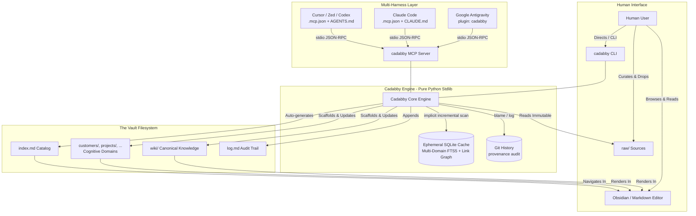
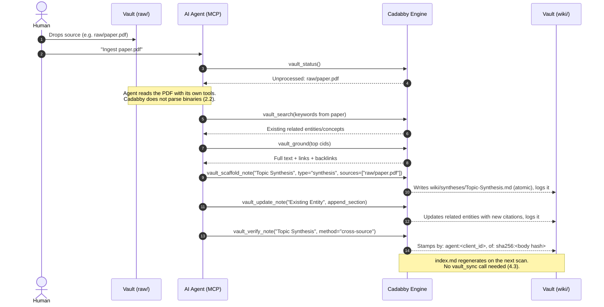

# Cadabby: Technical Specification

**Version:** 0.3.0  
**Status:** Approved Architecture (Multi-Domain Extended)  
**Author:** Pair programmed with Antigravity  
**Target Runtime:** CPython >= 3.11, standard library only

---

## 1. Executive Summary & System Vision

**Cadabby** is a zero-dependency, pure Python standard library engine (CLI + Model Context Protocol server) designed to power personal and shared **LLM Wiki vaults** optimized for seamless co-working between humans and autonomous AI agents.

It unifies four foundational paradigms:

1. **Andrej Karpathy's LLM Wiki Pattern**: A persistent, compounding knowledge base where the human curates raw, immutable sources and directs queries, while the AI agent acts as the primary "programmer" who compiles, updates, cross-references, and maintains the wiki markdown codebase.
2. **Open Knowledge Format (OKF v0.2)**: A rigorous epistemic trust hierarchy (`human-reviewed` > `machine-confirmed` > `stale-verified` > `unverified`) that resists hallucination compounding, enforces provenance, and keeps attribution auditable without suffocating agent autonomy.
3. **Self-Describing, Self-Governing Cognitive Domains**: Beyond the canonical `wiki/`, vaults can host arbitrary human-oriented and cognitive domains (e.g. `customers/`, `projects/`, `research/`), each governed by a local `{domain}/AGENTS.md` manifest defining note types, layout rules, source requirements, and prompt-injected agent directives.
4. **Multi-Harness Consumption**: First-class support for **Google Antigravity** (via native MCP tool provider, MCP resources, skills, and slash commands) and **Claude Code** (via `.mcp.json`, `CLAUDE.md`, and `.claude/commands/`), anchored by a single canonical constitution in `AGENTS.md` and localized domain directives.

### Key Tenets

* **Strict Zero Dependencies**: Requires only Python >= 3.11 and the standard library (`sqlite3`, `json`, `hashlib`, `re`, `argparse`, `pathlib`, `subprocess`). Eliminates virtualenv conflicts across heterogeneous agent subprocess environments.
* **Decoupled Engine**: Operates against any compliant Markdown vault directory; not bound to a single vault repository.
* **Disposable SQLite Cache**: Markdown files on disk are the single source of truth. The SQLite database (`.cadabby/cache.db`) is an ephemeral, disposable cache for incremental synchronization, multi-domain FTS5 BM25 search with epistemic boosting, and wikilink graph traversal. Deleting it is always safe.
* **Content-Bound Verification**: A verification record attests to *specific content*, not to a filename. Editing a note's body invalidates prior verifications automatically (§3.4). This is the mechanism that makes the trust hierarchy load-bearing rather than decorative.
* **Cognitive Domain Boundaries & Agent Autonomy**: Autonomous agents are provided both global vault principles (in `AGENTS.md`) and scoped behavioral constraints (in `{domain}/AGENTS.md`) injected during note grounding and surfaced via standard MCP Resources.
* **Auditability over Enforcement**: Cadabby does not claim to make forged human endorsements *impossible* — any agent with filesystem access can write arbitrary bytes. It makes them **unlikely by accident and detectable after the fact**: the engine refuses to stamp `human:*` over MCP, every write is atomic and Git-reversible, and `cadabby audit` cross-checks claimed human endorsements against Git authorship (§3.5).
* **Strict 7-Tool MCP Invariant**: Exactly 7 core tools are exposed to models, preventing cognitive tool degradation (§5.1). Domain policies are exposed via native MCP Resources (`resources/list`, `resources/read`), never by adding bloat tools.
* **Universal Portability**: A vault initialized with `cadabby init` works out of the box in Antigravity, Claude Code, Cursor, Zed, Codex, or any MCP-compatible environment. Portability is delivered by two files (`.mcp.json` and `AGENTS.md`); everything else in §7 is convenience on top.



---

## 2. Vault Architecture & Directory Conventions

A Cadabby vault adheres to a multi-domain architecture combining immutable evidence, canonical synthesis, and domain-scoped cognitive folders:

```text
my-vault/
├── .cadabby.json             # Vault configuration & root marker
├── .gitignore                # Ignores .cadabby/ and .obsidian/workspace*.json
├── .mcp.json                 # Standard MCP registration (auto-detected by harnesses)
├── AGENTS.md                 # Single canonical constitution & global agent directives
├── CLAUDE.md                 # Non-normative pointer delegating to AGENTS.md
├── GEMINI.md                 # Non-normative pointer delegating to AGENTS.md
├── STYLE.md                  # Voice, formatting, and prose standards
├── index.md                  # Auto-generated catalog of wiki content & sources
├── log.md                    # Append-only chronological activity ledger (active year)
│
├── log/                      # Rotated ledgers
│   └── 2025.md
│
├── .agents/                  # CANONICAL persona runbooks (see 7.1)
│   └── skills/
│       ├── librarian/SKILL.md    # Ingestion, synthesis, cross-referencing
│       └── technician/SKILL.md   # Cache health, linting, pre-commit maintenance
│
├── raw/                      # LAYER 1: Immutable Ground Truth
│   ├── 2026-paper-kv.pdf
│   ├── web-clip-article.md
│   └── audio-transcript.txt
│
├── wiki/                     # LAYER 2: Canonical Synthesis (LLM Maintained)
│   ├── entities/             # People, tools, organizations, libraries, models
│   │   ├── SQLite.md
│   │   └── Anthropic.md
│   ├── concepts/             # Core mechanisms, architectural patterns, ideas
│   │   ├── Epistemic-Trust-Tiers.md
│   │   └── Flash-Attention.md
│   ├── syntheses/            # Overviews, cross-domain topic syntheses
│   │   └── LLM-Wiki-Architecture.md
│   ├── comparisons/          # Structured comparative analyses & trade-offs
│   │   └── SQLite-vs-DuckDB.md
│   └── guides/               # Procedural how-tos and operational runbooks
│       └── Vault-Onboarding.md
│
├── customers/                # COGNITIVE DOMAIN: Self-governing customer accounts
│   ├── AGENTS.md             # Domain manifest & localized AI agent directives
│   └── acme-corp/
│       ├── README.md
│       └── Q3-Review.md
│
└── projects/                 # COGNITIVE DOMAIN: Self-governing engineering projects
    ├── AGENTS.md             # Domain manifest & localized AI agent directives
    └── apollo/
        └── README.md
```

### 2.1. Layer & Domain Responsibilities

| Layer / File | Primary Owner | Mutability | Description |
| :--- | :--- | :--- | :--- |
| **`raw/`** | Human | **Immutable** | Raw articles, web clips, PDFs, interview transcripts. Agents read but never modify. |
| **`wiki/`** | AI Agent | **Mutable** | Canonical knowledge synthesis: interlinked concept, entity, comparison, guide, and synthesis notes. Compiled and maintained by LLM. |
| **`{domain}/`** (e.g. `customers/`, `projects/`) | Human / Agent | **Mutable** | Self-governing cognitive domains hosting human-oriented or operational notes. |
| **`index.md`** | Engine | **Generated** | Categorized table of contents linking all `wiki/` pages and tracking raw source status. Never hand-edited. |
| **`log.md`** | Engine / Agent | **Append-Only** | Chronological record of ingests, queries, lint runs, and major syntheses. |
| **`AGENTS.md`** | Human / Agent | **Collaborative** | The global normative constitution for all AI agents working on this vault. |
| **`{domain}/AGENTS.md`** | Human / Domain Lead | **Normative** | Domain manifest (YAML schema constraints) and localized markdown agent directives injected during grounding (§2.2). |
| **`.agents/skills/`** | Human / Agent | **Collaborative** | Canonical persona runbooks. The only place persona behavior is defined (§7.1). |
| **`CLAUDE.md`**, **`GEMINI.md`** | Engine | **Write-once** | Thin non-normative pointers to `AGENTS.md`. Written by `init`, left untouched unless `--force` is specified (§7.3). |

In `wiki/`, the `type` frontmatter field (§3.1) and subdirectory are **required to agree**: a note of `type: comparison` lives in `wiki/comparisons/`. In custom cognitive domains, layout is flexible by default (§2.2).

### 2.2. Self-Describing Cognitive Domains (`{domain}/AGENTS.md`)

Cadabby treats any non-reserved top-level directory in the vault as an independent **Cognitive Domain**. Reserved directories (`raw/`, `log/`, `.cadabby/`, `.obsidian/`, `.git/`, `.agents/`, `.claude/`) and standard tool ignore folders (`DEFAULT_IGNORED_DIRS`: `.venv/`, `node_modules/`, `target/`, `dist/`, etc.) are excluded automatically.

A domain defines its governance rules and AI operational constraints through a local `{domain}/AGENTS.md` file:

```yaml
---
domain: customers
description: "Enterprise customer accounts, contacts, and contract histories"
searchable: true
allowed_types:
  - account
  - contact
  - meeting
require_sources: true
enforce_layout: false
---
# Customer Domain Agent Instructions

All customer profiles must maintain enterprise confidentiality.
- Ground every account fact against primary signed contracts in `raw/`.
- Architectural design decisions must wikilink to canonical concepts in `[[wiki/concepts/...]]`.
```

#### Governance Schema Fields
* **`domain`** *(string, optional)*: Explicit domain identifier (defaults to directory name).
* **`description`** *(string, optional)*: High-level purpose of the cognitive domain.
* **`searchable`** *(boolean, default: `true`)*: Whether notes in this domain are included in default multi-domain FTS searches.
* **`allowed_types`** *(list of strings, optional)*: If specified, `lint` gate 1 and `scaffold` strictly validate that notes in this domain use one of these types. If omitted (`None`), the domain is permissive and accepts any valid string type.
* **`require_sources`** *(boolean, default: `false`)*: If `true`, `lint` gate 4 treats missing or empty `sources:` as a validation error.
* **`enforce_layout`** *(boolean, default: `false`)*: If `true`, notes must reside in subdirectories matching their `type`. If `false`, flexible nested organizational structures (e.g. `customers/acme-corp/README.md`) are permitted.

#### Fallback Behavior
* **Unconfigured Domains**: A top-level directory lacking `AGENTS.md` is discovered as a permissive cognitive domain (`allowed_types: None`, `enforce_layout: false`, `require_sources: false`, `searchable: true`, empty directives).
* **Canonical `wiki/` Domain**: If `wiki/AGENTS.md` is not present, `wiki/` automatically defaults to canonical governance: 5 canonical types (`concept`, `entity`, `comparison`, `synthesis`, `guide`), `enforce_layout: true`, `require_sources: false`, `searchable: true`.

### 2.3. Generalized Content Identifiers (CIDs)

Cadabby uses canonical CIDs to uniquely reference notes across all cognitive domains:

* **Cognitive Domain Notes**: `rel_path` without file extension $\rightarrow$ `{domain}/{relative_stem}`.
  - `wiki/concepts/Epistemic-Trust-Tiers.md` $\rightarrow$ `wiki/concepts/Epistemic-Trust-Tiers`
  - `customers/acme-corp/README.md` $\rightarrow$ `customers/acme-corp/README`
  - `projects/apollo/rfc-001.md` $\rightarrow$ `projects/apollo/rfc-001`
* **Raw Sources**: Retain their filename and extension verbatim.
  - `raw/2026-paper-kv.pdf` $\rightarrow$ `raw/2026-paper-kv.pdf`
  - `raw/karpathy-llm-wiki-gist.md` $\rightarrow$ `raw/karpathy-llm-wiki-gist.md`

### 2.4. Raw Source Semantics

A file in `raw/` is **processed** if and only if at least one note in any cognitive domain lists it in `sources:`. This is derived, never stored — there is no ingestion state to drift out of sync, and `lint` gate 4 (§6.3) is its exact inverse.

**Cadabby does not extract text from binary sources.** A zero-dependency engine cannot read PDFs, audio, or images. Cadabby indexes the full text of recognized text formats (`.md`, `.txt`, `.markdown`, and any extension listed in `raw_text_extensions`); for every other file it records existence, size, and provenance edges only. Extracting meaning from `raw/paper.pdf` is the **agent's** responsibility using its own file-reading tools — Cadabby tracks that the edge exists and that the file has not changed.

### 2.5. Vault Configuration (`.cadabby.json`)

The config file doubles as the vault root marker. Root discovery walks up from the working directory, exactly like `.git`. All fields are optional; defaults shown.

```json
{
  "schema": 1,
  "vault_name": "my-vault",
  "raw_text_extensions": [".md", ".markdown", ".txt", ".rst", ".csv"],
  "integrity": "mtime_size",
  "ranking": {
    "trust": {
      "human-reviewed": 2.0,
      "machine-confirmed": 1.2,
      "stale-verified": 1.0,
      "unverified": 1.0
    },
    "status": {
      "evergreen": 1.0, "active": 1.0, "draft": 0.9,
      "completed": 0.85, "deprecated": 0.4, "abandoned": 0.4
    }
  },
  "identities": {
    "human:owner": ["owner@example.com"]
  },
  "obsidian": {
    "materialize_trust_tags": false
  },
  "log_rotate_bytes": 262144
}
```

`integrity` selects cache invalidation strategy: `"mtime_size"` (default, fast) or `"hash"` (stat plus SHA-256 of file bytes; immune to clock skew and same-second edits, costs a full read per file per scan).

`identities` maps OKF actor strings to Git author emails and is consumed only by `cadabby audit` (§3.5). `obsidian.materialize_trust_tags` is explained in §7.5.

---

## 3. Epistemic Trust Tiers & OKF Frontmatter Specification

Every Markdown note across `wiki/` and all discovered cognitive domains must contain valid frontmatter conforming to Open Knowledge Format (OKF v0.2), expressed in the **Restricted YAML Subset** defined in §3.2. (Domain manifests `{domain}/AGENTS.md` use this same subset).

### 3.1. Frontmatter Schema

```yaml
---
type: entity | concept | synthesis | comparison | guide | <domain-specific>
title: "Unique Human-Readable Title"
description: "One-line high-signal abstract or summary"
status: active | evergreen | draft | completed | deprecated | abandoned
tags:
  - knowledge-base
  - sqlite
sources:
  - raw/2026-paper-kv.pdf
  - raw/karpathy-llm-wiki-gist.md
verified:
  - by: human:owner
    at: '2026-10-03T12:00:00Z'
    method: manual-review
    of: 'sha256:9f2b7c1e4a8d05f3b6c29e7d1a4f80b35c6e9d2a7f41b8c035e6d9a2f74b1c80'
generated:
  by: agent:claude-opus-5
  at: '2026-10-03T11:45:00Z'
---
```

**Required**: `type`, `title`, `description`, `status`. **Optional**: `tags`, `sources`, `verified`, `generated`. Timestamps are RFC 3339 UTC with a `Z` suffix and must be single-quoted (an unquoted YAML timestamp is a typed scalar in full YAML, and the subset avoids implicit typing entirely).

* **Type Validation**: In `wiki/`, `type` must strictly be one of the five canonical types (`concept`, `entity`, `comparison`, `synthesis`, `guide`). In custom cognitive domains, `type` must match one of the entries in the domain's declared `allowed_types` (§2.2); if the domain defines no `allowed_types`, any non-empty string scalar is accepted.
* **Sources Requirement**: `sources` is optional by default, but is **required** whenever the note's enclosing cognitive domain specifies `require_sources: true` in `{domain}/AGENTS.md`.

**Deliberately omitted: `updated: {by, at}`.** The only epistemic question modification tracking needs to answer is "has this drifted since it was reviewed?", and `body_hash` vs. `of:` (§3.4) answers it from content rather than from a clock — immune to skew, out-of-order writes, and an agent forgetting to bump a field. Last-writer attribution is recorded losslessly by `log.md` and by Git, whereas a single overwritten slot would be lossy and self-reported. Note that `git clone` resets mtime to checkout time while preserving `git log`; conversely zip, Dropbox, Syncthing, and rsync preserve mtime but carry no history — so every realistic distribution path retains at least one of the two. Revisit only if a recency multiplier is added to ranking (§4.4), and even then prefer backfilling the timestamp from `git log` into the disposable cache over putting it in-band.

### 3.2. Restricted YAML Subset (normative)

A hand-rolled "robust YAML parser" is an unbounded project, and a lossy round-trip corrupts a human's hand-edited file. Cadabby therefore accepts a deliberately small, fully specified subset and **fails loudly** on anything outside it.

**Accepted grammar.** The frontmatter block is delimited by `---` on its own line at byte 0 and a closing `---`. Within it:

* **Block mappings** at indent 0: `key: value`.
* **Block sequences** of scalars: `- value`, indented 2 spaces under their key.
* **Block sequences of flat mappings**: `- key: value` followed by sibling `key: value` lines at the dash's content indent. Nesting depth stops here.
* **Scalars**: bare (`active`), single-quoted, or double-quoted. Escapes recognized inside double quotes: `\\ \" \n \t`. Bare scalars are never implicitly typed — everything is a string except the literals `true`, `false`, and `null`.
* **Comments**: a `#` beginning a line, or preceded by whitespace outside a quoted scalar. Comments and blank lines are preserved on round-trip where the surrounding structure is unchanged.

**Explicitly rejected**: flow style (`[a, b]`, `{k: v}`), anchors and aliases (`&`, `*`), tags (`!!str`), multi-line scalars (`|`, `>`), multi-document markers, mappings nested more than two levels, and sequences of sequences.

**Failure behavior.** A file whose frontmatter does not parse is **never written to**. It is recorded in the cache with `parse_error` set, excluded from search and graph results, and reported by `lint` as a `FRONTMATTER_UNPARSEABLE` error naming the offending line. Best-effort partial parsing is forbidden: a parser that guesses is a parser that silently destroys user data.

**Canonicalizing writer.** Every Cadabby write emits the canonical form: keys in schema order (`type`, `title`, `description`, `status`, `tags`, `sources`, `verified`, `generated`, then unrecognized keys alphabetically, preserved verbatim), two-space sequence indent, single-quoted timestamps, bare scalars where unambiguous. Humans may author anything inside the subset; the first agent write normalizes the file. This bounds the round-trip problem to "read subset, write one canonical form," which is testable to exhaustion.

### 3.3. Body Hash (normative)

The **body** is everything after the closing `---` of the frontmatter block. Its hash is computed over the normalized body:

1. Decode UTF-8.
2. Normalize line endings to `\n`.
3. Strip trailing whitespace from each line.
4. Strip leading and trailing blank lines.
5. Encode UTF-8, `sha256`, lowercase hex, prefixed `sha256:`.

The hash deliberately **excludes frontmatter**, so that retagging, restatusing, or adding a source does not invalidate a human's review of the prose. It is recomputed on every cache scan and stored as `notes.body_hash`.

### 3.4. Trust Tier Derivation

A verification entry is **valid** when its `of:` field is present and equals the note's current `body_hash`. The tier is derived from valid entries only:

1. **`human-reviewed`**: at least one *valid* entry with `by: human:*`. This represents ground truth for AI agents.
2. **`machine-confirmed`**: no valid human entry, but at least one *valid* entry with `by: agent:*` or `by: process:*`.
3. **`stale-verified`**: `verified` is non-empty, but no entry is valid — every attestation refers to content that has since changed, or predates the `of:` requirement. The records are preserved; the trust is not.
4. **`unverified`**: `verified` is absent or empty. Default state for newly scaffolded pages.

Actor strings match `^(human|agent|process):[A-Za-z0-9._\-/]+$`. A version suffix after `/` (`agent:gemini-flash/1.5`) is permitted and carries no special meaning.

**Why this matters.** Without content binding, a human verifies a note, an agent rewrites half of it, and the note reads `human-reviewed` forever — reintroducing the exact hallucination compounding the trust hierarchy exists to prevent. Drift is surfaced, not hidden: `status` reports a **verification debt** count, and `lint` gate 6 lists every stale note.

### 3.5. Identity, Attribution & Provenance Audit

Cadabby's identity model is a **convention with an audit trail**, not a security boundary. Stating the limits precisely:

* **What the engine guarantees.** The MCP server refuses to write `by: human:*` under any circumstances, and stamps `by: agent:<client_id>` taken from the JSON-RPC `initialize` handshake's `clientInfo.name`. `cadabby verify --human` requires an interactive TTY (`sys.stdin.isatty()`) and stamps `by: human:<os-username>`. Every write is atomic and leaves the vault in a Git-revertible state.
* **What it does not guarantee.** Agents that speak MCP in practice also hold filesystem and shell access; such an agent can edit the markdown directly or invoke the CLI. `clientInfo` is self-reported and unauthenticated, so `agent:<client_id>` is a claim, not an identity. The mechanism prevents *accidental* forgery — the overwhelmingly common case — and nothing more.
* **What is actually verifiable.** Git already records authenticated-ish authorship. `cadabby audit` locates the line introducing each `human:*` verification entry, runs `git blame --porcelain` on it, and compares the commit author email against the `identities` map in `.cadabby.json`. A mismatch — most importantly a human endorsement introduced by a commit authored by an agent — is reported as `PROVENANCE_MISMATCH`. With `--require-signed`, unsigned commits touching `human:*` lines are also flagged (`git log --show-signature`). This turns an unenforceable claim into a detectable one at the cost of one `subprocess` call per note.

`audit` is a no-op with a clear notice when the vault is not a Git repository.

---

## 4. SQLite Ephemeral Cache & Search Engine

The SQLite cache lives at `.cadabby/cache.db` and is 100% disposable. If deleted, any command reconstructs it on the next scan.

### 4.1. Runtime Capability Check

FTS5 ships with most but not all CPython SQLite builds. On first connection Cadabby probes for it and, if absent, aborts with an actionable message naming the Python interpreter and its `sqlite3.sqlite_version` rather than failing mid-query. Connections open with `PRAGMA journal_mode=WAL` and `PRAGMA busy_timeout=5000`.

### 4.2. Database Schema

`files` and `notes` are deliberately **one table** — they were 1:1 on `rel_path` and nothing was gained by splitting them.

```sql
-- One row per tracked file. Covers wiki/ notes and raw/ sources alike.
CREATE TABLE IF NOT EXISTS notes (
    id           INTEGER PRIMARY KEY,          -- FTS5 external-content rowid
    cid          TEXT NOT NULL UNIQUE,         -- "wiki/concepts/Epistemic-Trust-Tiers"
    rel_path     TEXT NOT NULL UNIQUE,         -- "wiki/concepts/Epistemic-Trust-Tiers.md"
    stem         TEXT NOT NULL,                -- "Epistemic-Trust-Tiers"
    layer        TEXT NOT NULL,                -- cognitive domain ("wiki", "customers", ...) | "raw"

    -- Invalidation
    mtime        REAL NOT NULL,
    file_size    INTEGER NOT NULL,
    file_hash    TEXT,                         -- populated only when integrity="hash"
    indexed_at   TEXT NOT NULL,

    -- Parsed OKF metadata (NULL for raw/ files)
    title        TEXT,
    description  TEXT,
    type         TEXT,
    status       TEXT,
    trust_tier   TEXT,                         -- derived, see 3.4
    body_hash    TEXT,                         -- see 3.3
    frontmatter_json TEXT,                     -- verbatim parsed frontmatter
    parse_error  TEXT,                         -- non-NULL => excluded from search

    -- Full text, stored once. Empty for binary raw/ sources.
    body         TEXT NOT NULL DEFAULT ''
);
CREATE INDEX IF NOT EXISTS idx_notes_layer_type ON notes(layer, type);
CREATE INDEX IF NOT EXISTS idx_notes_trust ON notes(trust_tier);

-- Wikilink graph. target_cid is NULL for dead links, which is what lint reads.
CREATE TABLE IF NOT EXISTS links (
    id          INTEGER PRIMARY KEY,
    source_cid  TEXT NOT NULL,
    target_raw  TEXT NOT NULL,                 -- "Flash-Attention#Tiling" exactly as written
    target_cid  TEXT,                          -- resolved; NULL = broken link
    alias       TEXT,                          -- "[[Note|alias]]" -> "alias"
    anchor      TEXT,                          -- "[[Note#heading]]" -> "heading"
    occurrences INTEGER NOT NULL DEFAULT 1
);
CREATE UNIQUE INDEX IF NOT EXISTS idx_links_edge
    ON links(source_cid, target_raw);
CREATE INDEX IF NOT EXISTS idx_links_target ON links(target_cid);
CREATE INDEX IF NOT EXISTS idx_links_source ON links(source_cid);

-- Provenance edges: wiki note -> raw source. Drives "processed" derivation (2.2).
CREATE TABLE IF NOT EXISTS sources (
    source_cid  TEXT NOT NULL,                 -- the wiki note
    raw_path    TEXT NOT NULL,                 -- as written in frontmatter
    resolved    INTEGER NOT NULL,              -- 1 if the file exists in raw/
    PRIMARY KEY (source_cid, raw_path)
);
CREATE INDEX IF NOT EXISTS idx_sources_raw ON sources(raw_path);

-- Contentless-external FTS5: the index is built, the text is not duplicated.
CREATE VIRTUAL TABLE IF NOT EXISTS notes_fts USING fts5(
    title, description, body, tags,
    content = 'notes',
    content_rowid = 'id',
    tokenize = 'porter unicode61'
);

CREATE TABLE IF NOT EXISTS cache_meta (
    key TEXT PRIMARY KEY,
    value TEXT NOT NULL
);
```

`tags` is not a column of `notes`; it is supplied to `notes_fts` at insert time as a space-joined string derived from `frontmatter_json`. Because external-content FTS5 stores only the inverted index and reads column values back from `notes`, the index must be maintained explicitly alongside every `notes` mutation:

```sql
-- Before updating or deleting a row, retract the old index entry.
-- The values passed here MUST be the row's OLD column values, read back
-- from `notes` first. Passing the new values silently corrupts the index:
-- the old terms are never retracted and stale matches persist forever.
INSERT INTO notes_fts(notes_fts, rowid, title, description, body, tags)
    VALUES('delete', :id, :old_title, :old_description, :old_body, :old_tags);
```

This is the single sharpest edge in the cache layer, so it is confined to one `cache.upsert_note()` / `cache.delete_note()` pair; **no other code path may write `notes` directly**. `test_cache.py` asserts the retraction by rewriting a note's body and confirming the old term no longer matches, then running `INSERT INTO notes_fts(notes_fts) VALUES('integrity-check')`.

`cache_meta` holds `schema_version`. **There are no migrations**: a version mismatch deletes `cache.db` and rebuilds. This is a disposable cache, and that freedom is worth more than incremental upgrade paths.

### 4.3. Synchronization

Sync is **implicit**. Every read command (`search`, `ground`, `status`, `graph`, `lint`) performs an incremental scan first; `cadabby sync` merely exposes it for debugging and `index.md` regeneration. An agent cannot forget to sync, because it cannot sync.

The scan walks `raw/` and all discovered cognitive domains (`wiki/`, `customers/`, `projects/`, etc.), skipping `DEFAULT_IGNORED_DIRS` and domain manifest files (`{domain}/AGENTS.md`). It `stat`s every file, and:

1. **Inserts** paths absent from `notes`.
2. **Reparses** paths whose `(mtime, file_size)` pair differs — or whose SHA-256 differs, under `integrity: "hash"`.
3. **Deletes** rows whose `rel_path` no longer exists on disk, including their `links`, `sources`, and `notes_fts` rows. *(Deletion reconciliation is not optional; without it, a renamed note haunts search results indefinitely.)*
4. Re-resolves `links.target_cid` for every edge whose target set changed.

`(mtime, file_size)` misses the pathological case of a same-second, same-length edit; `integrity: "hash"` exists for vaults where that matters. A full stat sweep of a few thousand notes costs single-digit milliseconds, so there is no staleness heuristic to get wrong.

### 4.4. Epistemic BM25 Rank Boosting & Domain Filtering

SQLite's `bm25()` returns **negative** values, more negative meaning a better match, so that `ORDER BY rank` ascending yields best-first. Multiplying a negative score is sign-sensitive and inverts silently if anyone later sorts the other way, so the sign is normalized once, at the query:

```sql
SELECT n.cid,
       (-bm25(notes_fts, 4.0, 2.0, 1.0, 1.5))
         * :trust_mult
         * :status_mult AS score
FROM notes_fts
JOIN notes n ON n.id = notes_fts.rowid
WHERE notes_fts MATCH :query
  AND n.parse_error IS NULL
  AND (n.layer = :domain OR (:domain IS NULL AND n.layer != 'raw'))
ORDER BY score DESC
LIMIT :limit;
```

Higher is better, unconditionally.

* **Domain-Filtered Search**: If `:domain` is provided (e.g. `domain="projects"`), search queries are constrained strictly to that cognitive domain. If omitted (`:domain IS NULL`), search spans all non-raw cognitive domains (`layer != 'raw'`).
* **Canonical Stem Resolution Priority**: In the link graph (`LinkTargetIndex`), known note CIDs are registered with `wiki/` stems first. A bare wikilink (`[[Architecture]]`) will always resolve to the canonical concept in `wiki/concepts/Architecture` rather than an arbitrary domain note. Notes in custom domains can be linked unambiguously via qualified CID (e.g. `[[customers/acme/Account]]`) or scoped stem (`[[acme/Account]]`).

Two properties of FTS5's `bm25()` make this multiplication safe, both verified against SQLite 3.53.2 and both easy to "fix" into a bug later:

* **It never crosses zero.** A term occurring in every indexed document would drive a textbook IDF negative, flipping `-bm25()` negative and inverting every multiplier precisely when the boost matters most. FTS5 clamps instead, bottoming out around `-1e-06`, so `-bm25()` is always ≥ 0 and multiplication is monotonic. Do not substitute a hand-rolled BM25 without re-establishing this.
* **It saturates for common terms.** When a query term appears in nearly every note, all matches collapse to that same clamped magnitude and the trust/status multipliers become the *only* ranking signal. This is the intended behavior — among equally unhelpful textual matches, prefer the human-reviewed one — but it means ranking tests must use discriminating terms or they will assert on noise.

The column weights (`title` 4.0, `description` 2.0, `body` 1.0, `tags` 1.5) are fixed; the multipliers come from `.cadabby.json` (§2.3) and default to:

* **Trust:** `human-reviewed` 2.0× · `machine-confirmed` 1.2× · `stale-verified` 1.0× · `unverified` 1.0×
* **Status:** `evergreen`/`active` 1.0× · `draft` 0.9× · `completed` 0.85× · `deprecated`/`abandoned` 0.4×

### 4.5. Epistemic Health & Domain Status Reporting

`VaultCache.get_status()` aggregates vault health metrics across all domains:
* `total_notes`: Count of all tracked notes across all cognitive domains.
* `total_wiki`: Count of notes in canonical `wiki/`.
* `domains`: Per-domain breakdown mapping `{domain_name: count}` (e.g. `{"wiki": 4, "customers": 1, "projects": 1}`).
* Epistemic verification debt, unverified counts, and broken links across the vault.

---

## 5. Cadabby Tool Surface (CLI & MCP)

The CLI and the MCP server expose the same engine, but **not the same surface**. Agents degrade as tool count rises, and several commands exist for the operator, not the model.

### 5.1. MCP Tools (Strict 7-Tool Invariant)

To prevent cognitive tool dilution and LLM routing degradation, Cadabby preserves a strict **7-tool invariant**. Cognitive domain operations enhance existing tool schemas rather than proliferating specialized domain tools:

| MCP Name | Multi-Domain Adaptations | Description |
| :--- | :--- | :--- |
| **`vault_search`** | Optional `domain` filter | FTS5 BM25 search across all cognitive domains (or filtered by `domain`), with trust boosting and filters (`type`, `status`, `trust`, `tag`, `domain`, `limit`). Returns cid, domain, title, description, trust tier, score, and snippet. |
| **`vault_ground`** | Directives & domain injection | Retrieves full or budget-truncated markdown for cids, **plus each note's domain, localized agent directives (`directives`), forward links, backlinks, and sources**. Grounding automatically equips agents with domain-specific behavioral rules. |
| **`vault_status`** | Domain counts breakdown | Epistemic health summary: note counts by tier, type, and domain (`domains: {...}`), verification debt (stale count), unprocessed `raw/` files, and broken links. |
| **`vault_scaffold_note`** | `domain` and `path` parameters | Creates a note in `wiki/` (matching its type) or within a target cognitive domain (`domain`, optional `path`), with valid OKF frontmatter and `generated:` attribution. Validates against domain `allowed_types`. Refuses to overwrite. |
| **`vault_update_note`** | Unchanged | Non-destructive frontmatter patches and content section append/replace-by-heading across any domain note. Never truncates unparseable files. |
| **`vault_verify_note`** | Unchanged | Appends a verification entry stamped `by: agent:<client_id>`, `at:` now, and `of:` the current body hash. Writing `human:*` over MCP is refused unconditionally. |
| **`vault_lint`** | 6-gate domain evaluation | Runs the dynamic six gates of §6.3 across all cognitive domains and returns structured diagnostics so agents can self-heal output. |

**Deliberately not exposed to agents:** `sync` (implicit — see §4.3), `log` (a side effect of write tools), `graph` 2-hop traversal (folded into `ground` at 1 hop), `audit`, `init`, and `install` (operator actions).

### 5.2. MCP Resources (Domain Directives & Configuration)

Standard MCP clients (including Antigravity, Claude Code, and Inspector) query MCP resources to inspect background context without consuming tool execution steps. Cadabby advertises `"resources": {}` capability in `initialize` and exposes two standard URI patterns:

| Resource URI | MIME Type | Description |
| :--- | :--- | :--- |
| **`vault://domains`** | `application/json` | Inventory of all discovered cognitive domains, their descriptions, `allowed_types`, `searchable`, `require_sources`, and `enforce_layout` flags. |
| **`domain://{domain}/directives`** | `text/markdown` | The localized agent instructions extracted from `{domain}/AGENTS.md` (e.g. `domain://customers/directives`). |

### 5.3. CLI Commands

| Command | Description |
| :--- | :--- |
| `cadabby init [path]` | Scaffolds a vault at `path` (default: current directory). Creates `.cadabby.json`, `.gitignore`, `.mcp.json`, `AGENTS.md`, pointer files, `.agents/skills/`, directory tree, seed `index.md`. Refuses to overwrite existing files without `--force`. |
| `cadabby search <query>` | As `vault_search`; `--domain`, `--type`, `--trust`, `--status`, `--tag`, `--limit`, `--json`. |
| `cadabby ground <cids...>` | As `vault_ground`; `--budget <tokens>`, `--json`. |
| `cadabby status` | As `vault_status`. |
| `cadabby scaffold <title>` | As `vault_scaffold_note`; `--domain <domain>`, `--path <path>`, `--type <type>`, `--desc <desc>`. |
| `cadabby update <path>` | As `vault_update_note`. |
| `cadabby verify <path>` | Appends a verification entry. `--human` requires a TTY and stamps `human:<username>`; otherwise stamps `process:cli`. |
| `cadabby lint` | Dynamic six gates across all domains; non-zero exit on error-severity findings, for CI. |
| `cadabby sync` | Forces an incremental scan across all domains and regenerates `index.md`. `--rebuild` discards `cache.db` first. |
| `cadabby log <msg>` | Appends a timestamped entry to `log.md`. |
| `cadabby graph <note>` | 1-hop and 2-hop neighbors: backlinks, forward links, co-citations. |
| `cadabby audit` | Git provenance audit of `human:*` endorsements (§3.5). `--require-signed`. |
| `cadabby mcp` | Runs the JSON-RPC 2.0 stdio MCP server exposing the 7 tools and domain resources. |
| `cadabby install` | Harness registration (§7.6). `--antigravity`, `--claude`, `--all`, `--path`, `--uninstall`, `--dry-run`. |

**Token budgeting** (`--budget`, `vault_ground`) uses a `len(text) / 4` character heuristic. A zero-dependency engine has no tokenizer; the estimate is documented as approximate, deliberately conservative, and truncates at section boundaries with an explicit `[truncated: N of M sections]` marker rather than mid-prose.

---

## 6. Core Operational Workflows

### 6.1. Ingestion Workflow (Compounding Synthesis)



### 6.2. Query & Answer Stash Workflow

1. Human asks an exploratory or comparative question.
2. Agent calls `vault_search`, then `vault_ground` on the top results to retrieve high-trust concepts with their graph neighborhood.
3. Agent synthesizes a response with `[[wikilink]]` citations.
4. **Compounding step**: if the synthesis represents enduring, non-trivial knowledge (e.g. a trade-off comparison), the agent calls `vault_scaffold_note(..., type="comparison")` to stash it permanently in `wiki/comparisons/`. The log entry and index refresh happen automatically.

### 6.3. Epistemic Linting Workflow

`cadabby lint` / `vault_lint` executes six deterministic gates across all discovered cognitive domains, skipping `{domain}/AGENTS.md` manifests. Each finding carries a stable code, a severity (`error` | `warning`), a `rel_path`, and a line number where applicable:

1. **Schema Integrity** — frontmatter parses within the §3.2 subset; required fields present (`title`, `description`, `status`, `type`); `status` within enum; timestamps RFC 3339.
   - For `wiki/`, `type` is strictly validated against the 5 canonical types.
   - For custom cognitive domains, `type` is validated against `domain_def.allowed_types` if configured in `{domain}/AGENTS.md` (§2.2). If unconfigured (`allowed_types: None`), any non-empty string type is permitted.
   - Codes: `FRONTMATTER_UNPARSEABLE`, `FIELD_MISSING`, `ENUM_INVALID`, `TIMESTAMP_INVALID`.
2. **Layout Consistency** — guarded by `domain_def.enforce_layout`.
   - In `wiki/` (`enforce_layout: true`), `type` must agree with the subdirectory (`TYPE_DIR_MISMATCH`).
   - In flexible cognitive domains (`enforce_layout: false`, default), notes may reside anywhere in the domain directory tree (e.g. nested in `customers/acme-corp/README.md`) without layout errors.
3. **Link Consistency** — every `[[Wikilink]]` resolves across all domains (`links.target_cid IS NOT NULL`). Alias and anchor forms are resolved against note CIDs and stems; anchors additionally checked against target markdown headings. Codes: `LINK_DEAD`, `ANCHOR_MISSING`.
4. **Provenance Check** — every `sources:` entry must exist under `raw/` (`sources.resolved = 1`). Furthermore, if the note's domain manifest specifies `require_sources: true`, an empty or omitted `sources:` list is flagged as an error. Reports unprocessed raw files as the inverse. Code: `SOURCE_MISSING`.
5. **Graph Connectivity** — flags orphan notes (zero inbound and zero outbound links). Evaluated for canonical `wiki/` notes (`WHERE n.layer = 'wiki'`), recognizing cross-domain links from external domains (e.g. a customer note linking to a wiki concept prevents that concept from being flagged as an orphan). Severity `warning`. Code: `NOTE_ORPHAN`.
6. **Verification Integrity** — actor strings match the §3.4 pattern; `of:` present on every entry; stale verifications enumerated as verification debt. Codes: `ACTOR_MALFORMED`, `VERIFICATION_UNBOUND` (missing `of:`), `VERIFICATION_STALE`.

`cadabby audit` (§3.5) is deliberately a separate command: it shells out to Git, is orders of magnitude slower than the six gates, and should not sit in an agent's inner loop.

---

## 7. Multi-Harness Consumption Architecture

Cadabby operates across heterogeneous agent harnesses without configuration divergence. The governing principle is that **every instruction has exactly one home**, and harness-specific files are shims that point at it.

### 7.1. Single-Definition Invariant

Rule drift across harnesses is the failure mode this section exists to prevent, so the rule applies to personas as strictly as it applies to the constitution:

* **`AGENTS.md` is the sole normative contract.** Practitioner voice, epistemic trust tiers, scaffolding rules, and tool preferences are defined there and nowhere else.
* **`.agents/skills/<persona>/SKILL.md` is the sole definition of each persona.** There are exactly two, named identically in every context: **`librarian`** (ingestion, synthesis, cross-referencing) and **`technician`** (cache health, linting, pre-commit maintenance).
* **Every harness-specific file is non-normative and thin.** `CLAUDE.md`, `GEMINI.md`, Antigravity subagent manifests, and slash commands contain pointers and invocations, never behavior. If a harness file grows prose that could contradict `AGENTS.md`, that is a defect.

A consequence worth stating: a persona must never be defined once in the vault and again in an installed plugin. The Antigravity subagent manifests (§7.2) carry a name, a model preference, and an instruction to load `.agents/skills/<persona>/SKILL.md` from the active vault. They carry no runbook text of their own.

### 7.2. Google Antigravity Plugin

Cadabby bundles a plugin in `plugins/cadabby/`:

```text
plugins/cadabby/
├── plugin.json               # Antigravity plugin manifest
├── mcp_config.json           # MCP tool provider configuration
├── skills/
│   └── cadabby-wiki/
│       └── SKILL.md          # Entry-point skill: progressive disclosure, points to AGENTS.md
└── agents/
    ├── librarian/agent.md    # Thin manifest -> .agents/skills/librarian/SKILL.md
    └── technician/agent.md   # Thin manifest -> .agents/skills/technician/SKILL.md
```

**Capabilities.** The `cadabby-wiki` skill injects high-level wiki operations into context without consuming prompt tokens up front. The root agent delegates reading, drafting, and cross-linking to **librarian**, and cache maintenance, diagnostics, and linting to **technician**. Slash commands `/ingest`, `/vault-status`, and `/vault-lint` are available in the chat UI.

> **Verified Architecture (v0.3.0).** The manifest layout conforms to the single-definition invariant (§7.1): entry-point progressive disclosure skill at `skills/cadabby-wiki/SKILL.md` and thin subagent manifests in `agents/` delegating runbook execution directly to `.agents/skills/<persona>/SKILL.md` in the active vault. `cadabby init` scaffolds this plugin directly into `.agents/plugins/cadabby/` to guarantee zero-configuration, vault-scoped MCP auto-mount for Antigravity, symmetric with `.mcp.json` for Claude Code.

### 7.3. Claude Code Integration

1. **Auto-mount via `.mcp.json`** (written by `cadabby init`):

   ```json
   {
     "mcpServers": {
       "cadabby": {
         "command": "/usr/bin/python3",
         "args": ["-m", "cadabby", "mcp"]
       }
     }
   }
   ```

   The command is `python3 -m cadabby`, **not** a bare `cadabby` console script. Agent subprocesses frequently inherit a different `PATH` than the user's shell — which is precisely the environment-divergence problem the zero-dependency tenet exists to solve — and a console script only exists after an install step that running from source skips. `init` writes `sys.executable` as an absolute path when it can resolve one, falling back to `"python3"`.

2. **Harness delegation via `CLAUDE.md`.** A ~15-line non-normative pointer instructing Claude Code to read `AGENTS.md` as the single constitution, to prefer native MCP tools over subshell commands, and never to override actor identity when stamping `verified:`. **`init` writes it once and no command ever rewrites it** — users customize `CLAUDE.md` heavily, and an engine that regenerates it will eventually destroy their work. `init --force` is the only path that overwrites, and it says so.

3. **Slash commands in `.claude/commands/`.** `/ingest`, `/vault-status`, `/vault-lint` — the same high-level verbs Antigravity users get.

### 7.4. Keeping Harness Shims From Going Stale

Antigravity's plugin installs globally and upgrades with Cadabby. Claude Code's `.claude/commands/` are copied into the vault by `init` and frozen at that version. Left alone, a fix to `/ingest` would reach one group of users and never the other.

The resolution is to make the shims too thin to need fixing. A command file invokes the CLI or names a persona; it carries no logic:

```markdown
---
description: Ingest an unprocessed source from raw/ into the wiki
---
Follow the librarian runbook at `.agents/skills/librarian/SKILL.md`,
then run the ingestion workflow for: $ARGUMENTS
```

Behavior lives in `.agents/skills/` and `AGENTS.md`, both of which are vault content the user can update by pulling. Running `cadabby init --force` re-copies the shims for anyone who wants them refreshed, but a stale shim is harmless by construction.

### 7.5. Obsidian Configuration (optional)

`init` can write a minimal `.obsidian/app.json`. Two constraints:

* **`.gitignore` must exclude `.obsidian/workspace*.json`.** Obsidian rewrites workspace state constantly, and committing it produces a diff on every session.
* **Trust-tier graph coloring requires materialized tags.** Obsidian colors graph nodes from stored properties, but `trust_tier` is *derived* from the `verified` array (§3.4) and never written to the file, so there is nothing for Obsidian to query. The feature only works if the engine maintains a real tag. Setting `obsidian.materialize_trust_tags: true` (§2.3) makes `sync` keep a `trust/<tier>` entry in each note's `tags`, and `init` then writes a `graph.json` with matching color groups.

  This is **off by default** and deliberately so: it writes derived state into the source of truth, which contradicts the project's central principle, and it dirties the frontmatter of every note whose tier changes. It is offered because a colored graph is genuinely useful, not because it is clean. Note that materialized tags do *not* invalidate verification — the body hash excludes frontmatter (§3.3).

### 7.6. Harness Registration (`cadabby install`)

```bash
cadabby install --antigravity      # install plugin into the Antigravity plugin directory
cadabby install --claude           # register the MCP server with Claude Code
cadabby install --all              # both
cadabby install --claude --uninstall
cadabby install --all --dry-run    # print every file that would change, write nothing
```

Registration edits configuration files the user owns, so the merge semantics are the feature, not an afterthought:

* **Idempotent.** Running `install` twice is a no-op. The implementation compares desired state to actual and writes only on difference.
* **Non-destructive merge.** Target configs are parsed, the `cadabby` key is updated in place, and everything else is preserved byte-for-byte where the format allows. Cadabby never rewrites a config it failed to parse, and never truncates one it cannot write atomically (§8).
* **Conflict-aware.** An existing `mcpServers.cadabby` entry pointing somewhere else is reported and left alone unless `--force` is passed.
* **Path-overridable.** `--path` overrides the install destination. Another product's config directory is not a stable interface, so the default is a detection attempt with a clear error — never a silently hardcoded path.
* **No hard CLI dependency.** `--claude` writes the config file directly rather than requiring the `claude` binary. If a harness CLI is present it may be used; if absent, `install` still succeeds.
* **Uninstallable.** `--uninstall` removes exactly what `install` added, leaving user keys intact.

---

## 8. Durability & Concurrency

A vault is a directory in Git that a human in Obsidian and one or more agents may touch at once. The invariant is that **no interleaving leaves a file half-written**.

* **Atomic writes.** Every file mutation writes to a temporary file in the *same directory*, `fsync`s it, and `os.replace()`s it over the target. A crashed or killed Cadabby never produces a truncated note. This applies to harness config files written by `install` as much as to vault notes.
* **Read-modify-write safety.** `update` and `verify` re-read the file and recompute its hash immediately before replacing it; if the on-disk content changed since the operation began, the write aborts with `VAULT_CONFLICT` rather than clobbering a concurrent edit.
* **Ledger appends.** `log.md` is appended with a single `write()` to a descriptor opened `O_APPEND`, which is the one case where no locking is required. (Atomicity holds for appends below the platform's pipe-buffer size; entries are single lines, far below it.)
* **Index regeneration.** `index.md` is regenerated under an advisory lock (`.cadabby/vault.lock`, created `O_CREAT | O_EXCL`, holding pid and start time, treated as stale after 60 seconds). Rows are emitted in a **deterministic sort order** and the file is **written only if its bytes changed** — otherwise every sync churns the Git diff for nothing.
* **Cache concurrency.** WAL mode plus a 5-second busy timeout. Two processes scanning simultaneously is correct but wasteful; it is not an error.
* **Log rotation.** When `log.md` exceeds `log_rotate_bytes` (default 256 KB) or crosses a calendar year, `sync` moves it to `log/<year>.md` and starts a fresh ledger. An unbounded ledger eventually becomes a file agents waste their whole context window reading.

---

## 9. Codebase Packaging & Repository Structure

```text
cadabby/
├── pyproject.toml              # Build config (flit), zero runtime deps, requires-python = ">=3.11"
├── README.md                   # Quickstart, installation, and harness usage
├── LICENSE                     # MIT
├── SPECIFICATION.md            # This document
│
├── src/
│   └── cadabby/
│       ├── __init__.py         # Package exports & version
│       ├── __main__.py         # Entry point for python3 -m cadabby
│       ├── cli.py              # argparse surface and terminal formatting
│       ├── constants.py        # Enums, default config, schema constants
│       ├── domain.py           # Cognitive domain definitions and AGENTS.md parsing (§2.2)
│       ├── vault.py            # Root discovery, config loading, path/cid mapping
│       ├── frontmatter.py      # Restricted-subset parser + canonicalizing writer (3.2)
│       ├── okf.py              # Schema validation, body hashing, trust tier derivation (3.3-3.4)
│       ├── fsutil.py           # Atomic replace, advisory lock, O_APPEND ledger writes
│       ├── cache.py            # SQLite connection, FTS5 probe, scan/upsert/delete, search
│       ├── graph.py            # Wikilink extraction, resolution, backlink queries
│       ├── indexer.py          # index.md generation and log.md append/rotate
│       ├── lint.py             # The dynamic six gates across all domains (6.3)
│       ├── audit.py            # Git blame provenance audit (3.5)
│       ├── ops.py              # scaffold, update, verify, ground (with domain enrichment)
│       ├── installer.py        # cadabby init / install, idempotent config merge (7.6)
│       └── mcp.py              # JSON-RPC 2.0 stdio handler, 7 tools + domain resources
│
├── assets/                     # Single source for everything `init` and the plugin ship
│   ├── vault/                  # Vault starter template
│   │   ├── .cadabby.json
│   │   ├── .gitignore
│   │   ├── .mcp.json
│   │   ├── AGENTS.md
│   │   ├── CLAUDE.md
│   │   ├── GEMINI.md
│   │   ├── STYLE.md
│   │   ├── index.md
│   │   └── obsidian/app.json
│   ├── skills/                 # CANONICAL persona runbooks (7.1)
│   │   ├── librarian/SKILL.md
│   │   └── technician/SKILL.md
│   └── commands/               # Thin slash-command shims, harness-agnostic (7.4)
│       ├── ingest.md
│       ├── vault-status.md
│       └── vault-lint.md
│
├── plugins/                    # Antigravity plugin, assembled from assets/
│   └── cadabby/
│       ├── plugin.json
│       ├── mcp_config.json
│       ├── skills/cadabby-wiki/SKILL.md
│       └── agents/
│           ├── librarian/agent.md
│           └── technician/agent.md
│
├── examples/
│   └── demo-vault/             # Golden fixture: used by tests and the README
│
└── tests/
    ├── test_frontmatter.py     # Subset parsing, rejection cases, round-trip fidelity
    ├── test_okf.py             # Body hashing, tier derivation, staleness on edit
    ├── test_cache.py           # Scan, deletion reconciliation, FTS5 ranking sign & integrity
    ├── test_graph.py           # Alias/anchor/path wikilink resolution, dead links
    ├── test_lint.py            # Each gate's codes and severities
    ├── test_ops.py             # Scaffolding, attribution, conflict detection, atomicity
    ├── test_mcp.py             # Handshake, tool execution, human:* refusal
    ├── test_domains.py         # Multi-domain discovery, cache, linting, ops, MCP resources, end-to-end
    ├── test_audit.py           # Git provenance mismatch detection (temp repo fixture)
    └── test_installer.py       # init scaffolding, idempotency, merge, uninstall, dry-run
```

`assets/` exists so that persona runbooks and command shims have exactly one on-disk home in the repository (§7.1). `cadabby init` copies from it into the vault; the plugin build assembles from it. Neither maintains its own copy.

---

## 10. Implementation Plan & Acceptance Criteria

Build order is chosen so each stage is testable before anything depends on it.

**Phase 1 — Parsing & Vault Primitives**
`frontmatter.py` (restricted subset + canonicalizing writer, with exhaustive round-trip and rejection tests), `vault.py`, `fsutil.py` (atomic writes, locking). Nothing above this is trustworthy if the parser is not.

**Phase 2 — Cache & Search**
`cache.py`: FTS5 capability probe, merged schema, incremental scan *including deletion reconciliation*, normalized-sign ranking. `examples/demo-vault/` is built here and becomes the fixture for everything downstream.

**Phase 3 — Atomic Tools**
`okf.py` (body hashing, tier derivation), `ops.py` (scaffold/update/verify with content-bound verification and conflict detection), `graph.py`, `indexer.py`, `lint.py`.

**Phase 4 — Protocols & Universal Portability**
`cli.py` first — a surface you can drive by hand is the only practical way to debug the one you cannot — then `mcp.py`, then `audit.py`. `cadabby init` ships `.mcp.json` and `AGENTS.md`, which is the whole of the portability claim: at the end of this phase the vault works in Claude Code, Cursor, Zed, and Codex with no harness-specific code.

**Phase 5 — Cognitive Domain Architecture & Harness Convenience**
Dynamic domain discovery (`domain.py`), multi-domain FTS5 cache indexing and stem resolution, dynamic 6-gate epistemic linter with flexible layout bypass, directives enrichment on note grounding, MCP resources (`vault://domains`, `domain://{domain}/directives`) preserving the strict 7-tool boundary, and end-to-end lifecycle verification.

### Acceptance Criteria for 0.3.0

* Deleting `.cadabby/` and re-running any command reproduces byte-identical search results across all cognitive domains.
* Editing a verified note's body downgrades it to `stale-verified` on the next scan, and `status` counts it as verification debt.
* Frontmatter outside the §3.2 subset is reported by `lint` and is never rewritten.
* `lint` exits non-zero on a demo vault seeded with one instance of each error code, and zero on the clean demo vault.
* Non-reserved top-level folders are discovered as cognitive domains; `{domain}/AGENTS.md` manifests configure `allowed_types`, `enforce_layout`, `require_sources`, and markdown agent directives.
* `vault_scaffold_note` creates notes in target domains and validates types against the domain's manifest.
* `vault_ground` injects the note's domain and localized agent directives into the response payload.
* `vault_search` filters by `--domain` when requested, and searches all non-raw cognitive domains when omitted.
* Canonical `wiki/` stems take priority in `LinkTargetIndex`, preventing collisions with domain notes.
* The MCP server exposes exactly 7 tools, advertising `"resources": {}` and serving `vault://domains` and `domain://{domain}/directives` via JSON-RPC `resources/list` and `resources/read`.
* Flexible cognitive domains bypass Gate 2 layout checks, while `wiki/` strictly enforces directory matching. Notes linking across domains prevent false orphan warnings in Gate 5.
* A `vault_verify_note` call attempting `by: human:*` is rejected with a JSON-RPC error.
* `cadabby audit` detects a `human:owner` entry introduced by a commit authored by an unmapped email.
* A note renamed on disk leaves no stale row in `notes`, `links`, `sources`, or `notes_fts`, and `INSERT INTO notes_fts(notes_fts) VALUES('integrity-check')` passes afterward.
* A `human-reviewed` note outranks an identically-matching `unverified` note, and a `deprecated` one is pushed below both.
* `cadabby sync` run twice in a row produces no Git diff on the second run.
* `cadabby init` into a directory with an existing `CLAUDE.md` leaves that file untouched and says so.
* `cadabby install --all` run twice changes no bytes on the second run; `--uninstall` restores the pre-install config exactly.
* No persona behavior text appears in more than one file across the repository.
